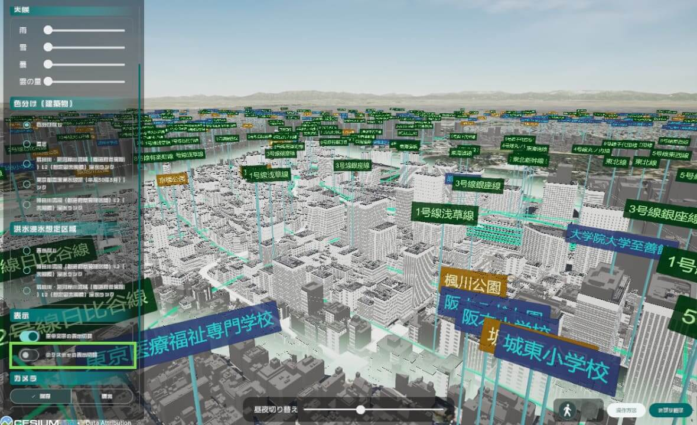
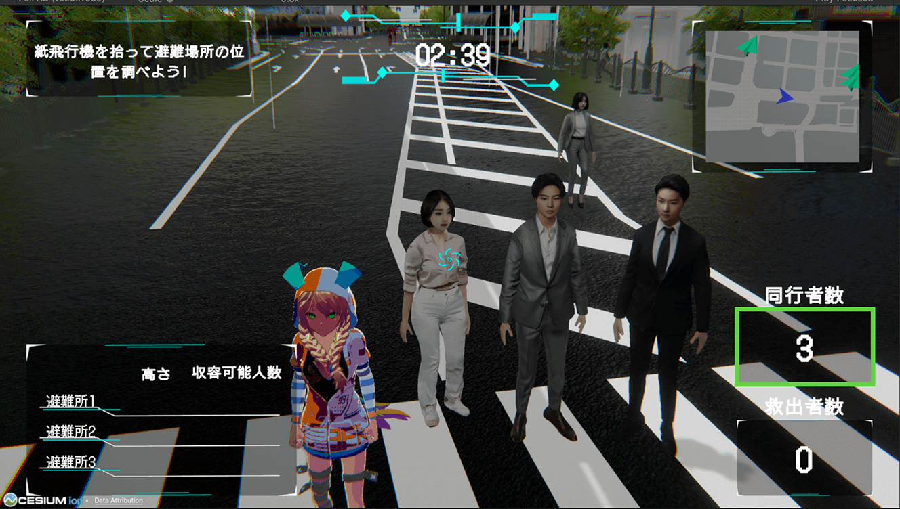

# PLATEAU SDK for Unity

このパッケージには、[PLATEAU](https://www.mlit.go.jp/plateau/)の3D都市モデルデータを利用するためのAPI、サンプルが含まれます。PLATEAU SDK for Unityを利用することで、実世界を舞台にしたゲームの開発や、PLATEAUの豊富なデータを活用したシミュレーションを簡単に行うことができます。
  

## SDKでできることを知る  

都市データを使ったアプリやシミュレーションの例を下に示します。

- **[PLATEAU SDKを使ったGISサンプル](https://www.mlit.go.jp/plateau/learning/tpc17-1/#p17_3_1)**
  

- **[PLATEAU SDKを使ったゲームサンプル](https://www.mlit.go.jp/plateau/learning/tpc17-1/#p17_3_2)**
  

## SDK活用の実践編

PLATEAU SDK for Unity を用いて実際にコンテンツを構築するチュートリアルをいくつかご紹介します。

#### 初級編：サンプルをカスタマイズして自分のデータに合わせてみよう

まずは用意されたサンプルを少し変更して、自分の都市データに合わせてみましょう。  
簡単な操作で建物に色を付けたり、クリックで情報を表示できるようになります。

  

- **[属性情報によって色分けする | PLATEAU SDK for Unity](https://project-plateau.github.io/PLATEAU-SDK-for-Unity/manual/ChangeColorByAttrs.html)**
- **[属性情報を表示する | PLATEAU SDK for Unity](https://project-plateau.github.io/PLATEAU-SDK-for-Unity/manual/DisplayAttrs.html)**

#### 中級編：実際にミニゲームを作ってみよう

次のステップとして、実際に都市空間を利用したゲームを実際に構築してみましょう。  
キャラクターの移動や基本的な操作要素を追加することで、都市データを舞台とした簡易的なミニゲームを実装できます。
 
<iframe src="https://www.youtube.com/embed/jXWqIb2nGtk?si=k6ytJs3nW8wFENFk" frameborder="0" allowfullscreen style="aspect-ratio:16/9"></iframe>

- **[Unityで都市を爆走するミニゲームを作る[1/2]｜3D都市モデルを使ったゲームを作る](https://www.mlit.go.jp/plateau/learning/tpc18-1/)**
- **[Unityで都市を爆走するミニゲームを作る[2/2]｜音やエフェクトをつけてゲームらしくする](https://www.mlit.go.jp/plateau/learning/tpc18-2/)**

#### 上級編：ゼロから好きなゲームやシミュレーションを構築しよう

基礎的な実装を習得したら、ゼロから自由にプロジェクトを設計しましょう。  
PLATEAU SDK には都市データを活用するための多様な機能が備わっており、独自のゲームやシミュレーション開発に応用可能です。  
本マニュアルを参照しながら、目的に応じた設計と実装を進めてください。  

> [!NOTE]
> PLATEAU SDK for Unityは利用者アンケートを実施しています。  
> 今後の開発の参考にするため、ユーザーの皆様の忌憚ないご意見をお聞かせください。  
> **[◆アンケートはこちら](https://forms.gle/xZWLM96JNBT2hhRA9)**

> [!NOTE]
> PLATEAU Slackコミュニティにどなたでもご参加いただけます。  
> 参加希望の方は、お問い合わせページよりお気軽にお問い合わせください。  
> **[◆お問い合わせページはこちら](https://www.mlit.go.jp/plateau/contact/)**  

 
> [!NOTE]
>**PLATEAU SDK-Toolkits for Unity**  
>3D都市モデルを利用したUnity上でのアプリケーション開発を支援するツールキット群として「PLATEAU SDK-Toolkits for Unity」を公開しています。  
>PLATEAU SDK-Toolkits for Unity は PLATEAU SDK for Unity を前提とするアドオンですので、是非あわせてご利用ください。  
 **[◆PLATEAU SDK-Toolkits for Unityのリポジトリはこちら](https://github.com/Project-PLATEAU/PLATEAU-SDK-Toolkits-for-Unity)**
