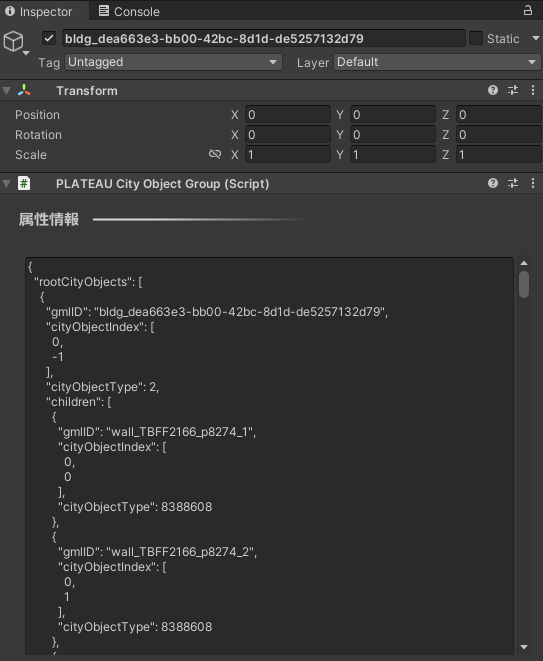

# 属性情報へのアクセス

C# APIやPLATEAU SDKの機能によって都市オブジェクトの情報を取得できます。  
このページでその方法を説明します。

## 属性情報を確認する(PLATEAU SDKのエディタ機能)
PLATEAU SDKウィンドウの「属性情報」タブを開いた状態で地物をクリックすると、  
その地物IDと属性情報が表示されます。

- シーンビュー上のピンク色の線は、選択中の主要地物の範囲を示します。
- シーンビュー上の緑色の線は、選択中の最小地物の範囲を示します。
- 地物IDがシーンビュー中の文字で表示され、属性情報は属性情報ウィンドウのテキストボックスに表示されます。

### 主要地物と最小地物について
- 例えば、建物を主要地物単位でインポートした場合は、1つのゲームオブジェクトおよび1つのメッシュで1つの建物を表します。  
  その1つのメッシュを分解すると、「壁」「屋根」などのパーツになります。  
  この場合、建物全体が主要地物であり、壁、屋根などのパーツが最小地物に該当します。  
  ここで建物をクリックして属性情報を表示すると、主要地物（建物全体、1つのメッシュ）としての属性情報と、最小地物（壁や屋根など、メッシュの一部分）としての属性情報が両方表示されます。
- 建物を最小地物単位でインポートした場合、壁や屋根ごとにゲームオブジェクトおよびメッシュが分かれます。  
  この場合、最小地物ゲームオブジェクトの親ゲームオブジェクトから主要地物の情報を取得します。
- 建物を地域単位でインポートした場合、複数の主要地物が結合されます。  
  この場合、メッシュの一部分として主要地物および最小地物の情報を取得できます。
  

## 属性情報を確認する（ランタイム）
ランタイムで、クリックした建物の情報を表示するサンプルを用意しています。  
次の方法で確認できます。
- 下図のボタンをクリックして `Attributes Sample` をインポートします。
    
　　図は Package Manager の Import ボタンを押している様子です。
- シーン AttributesSample を開きます。
- Playボタンで再生します。
- クリックした建物の情報が画面に表示されます。  
  
- ソースコード `ClickToShowAttributes.cs` の中に、この実装とコメントでの説明が記載されています。


## 都市モデルの情報を表示

PlateauSDKでインポートした都市オブジェクトには属性等の情報が含まれています。  
情報にアクセスするには、都市オブジェクトであるGameObjectにアタッチされた`PLATEAUCityObjectGroup`コンポーネントを使用します。  
`PLATEAUCityObjectGroup`コンポーネントには都市オブジェクトの持つ個別の情報がJson形式で表示されています。  

  

このJsonの内容は、`PLATEAUCityObjectGroup.CityObjects`から利用可能なデータ`CityObjectList`として取得できます。  
`CityObjectList.rootCityObjects`リストには、`CityObject`が格納されています。これは地域単位でのインポートの場合は複数になり、そうでないときは1つになります。  
`CityObject`の属性を取得することで地物（建物など）の情報を取得できます。
`CityObject.Children`には、都市オブジェクトの階層の子に当たる`CityObject`が格納されます。  

## 属性とは

都市オブジェクトの情報は「属性」として取得できます。  
属性は例えば  
  
```text
(String) 大字・町コード => 42,
(String) 防火及び準防火地域 => 準防火地域
```
  
のように、キーと値のペアからなる辞書形式の情報です。  
属性辞書`Attributes`は `CityObject.AttributesMap` メソッドで取得できます。  
`Attributes.DebugString()` をコールすると、属性情報をすべて文字列にして返します。　　
`Attributes.TryGetValue("key", out value)` によってキーに対応する`Attributes.Value` を取得できます。  
`Attributes.Value` の具体的な値は文字列型として取得できるか、または  
子の属性（属性は入れ子になることもあります）として取得できるかのいずれかです。  
属性が入れ子になっている例は次のとおりです。

```text
 (AttributeSet) 多摩水系多摩川、浅川、大栗川洪水浸水想定区域（想定最大規模） => 
    [ { (String) 浸水ランク => 2 }
    { (Measure) 浸水深 => 0.990 }
    { (Measure) 継続時間 => 0.68 }
    { (String) 規模 => L2 }  
]}
```

上の例において、(括弧)内の文字は属性の型を示します。  
属性値は次の型があります。:  
`AttributeSet, String, Double, Integer, Data, Uri, Measure`  
AttributeSet以外の型はすべて内部的には文字列型であり、  
`Attributes.Value.StringValue` で値を取得できます。  
入れ子AttributeSetの値は `StringValue` ではなく `Attributes.Value.AttributesMapValue`で取得できます。  
属性値の型は `Attributes.Value.Type` で取得でき、この値が `AttributeSet` である場合は　　
`Attributes.Value.AttributesMapValue`で子の `Attributes` を取得できます。  
`Attributes.Value.Type` がそれ以外 (String, Doubleなど) である場合は `Attributes.Value.StringValue` で文字列を取得できます。

