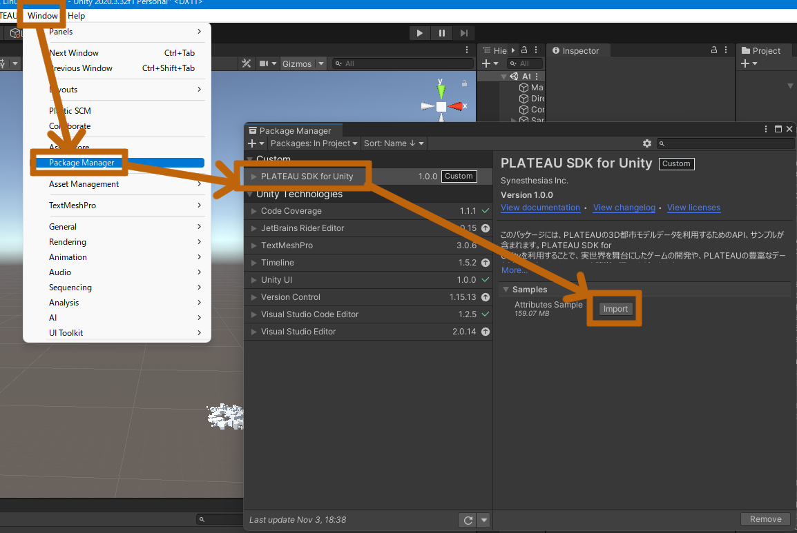
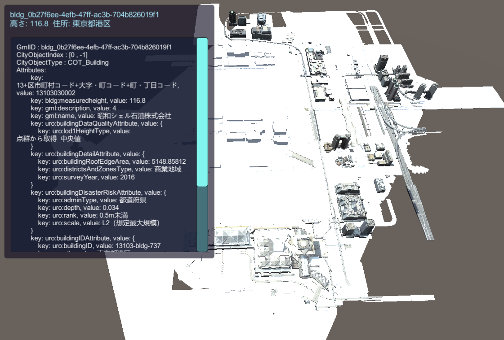
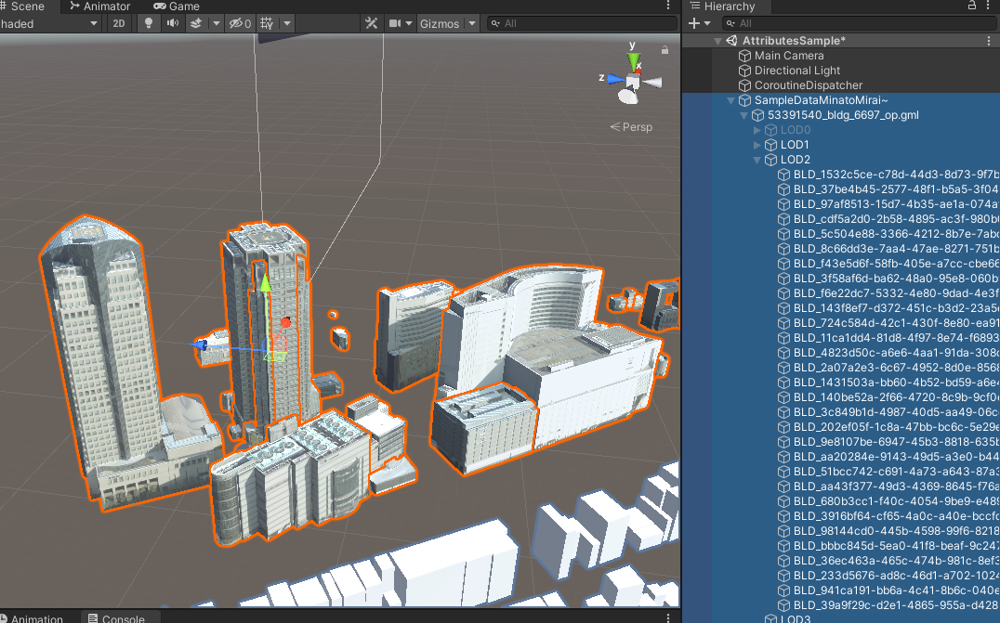

# 都市情報へのアクセス

C# APIによって都市オブジェクトの情報を取得できます。  
このページでその方法を説明します。

## サンプル
クリックした建物の情報を表示するサンプルを用意しています。  
次の方法で確認できます。
- 下図のボタンをクリックして `Attributes Sample` をインポートします。
    
　　図は Package Manager の Import ボタンを押している様子です。
- シーン AttributesSample を開きます。
- Playボタンで再生します。
- クリックした建物の情報が画面に表示されます。  
  
- ソースコード `ClickToShowAttributes.cs` の中に、この実装とコメントでの説明が記載されています。

## 都市モデルのロード
  
都市に関するデータは、GMLファイルをパースすることで得られます。  
`PLATEAUCityGmlProxy.LoadAsync` によってGMLファイルがパースされ、  
パース結果が `CityModel` 型で返ります。  
`CityModel` の中には `CityObject` が木構造で格納されています。  
木構造をたどるか `CityModel.GetCityObjectById` メソッドによって `CityObject`を取得できます。  
このメソッドに渡すべきIDは、インポート時にメッシュ結合単位を "最小地物単位" または "主要地物単位" にすることでゲームオブジェクト名に記載されます。  
`CityObject`の属性を取得することで地物（建物など）の情報を取得できます。

## 属性とは

都市オブジェクトの情報は「属性」として取得できます。  
属性は例えば  
  
```text
(String) 大字・町コード => 42,
(String) 防火及び準防火地域 => 準防火地域
```
  
のように、キーと値のペアからなる辞書形式の情報です。  
属性辞書は `CityObject.AttributesSet` メソッドで取得できます。  
`AttributesSet.ToString()` をコールすると、属性情報をすべて文字列にして返します。　　
`AttributesSet.GetValueOrNull("key")` によってキーに対応する`AttributeValue` を取得できます。  
`AttributeValue` の具体的な値は文字列型として取得できるか、または  
子の属性（属性は入れ子になることもあります）として取得できるかのいずれかです。  
属性が入れ子になっている例は次のとおりです。

```text
 (AttributeSet) 多摩水系多摩川、浅川、大栗川洪水浸水想定区域（想定最大規模） => 
    [ { (String) 浸水ランク => 2 }
    { (Measure) 浸水深 => 0.990 }
    { (Measure) 継続時間 => 0.68 }
    { (String) 規模 => L2 }  
]}
```

上の例において、(括弧)内の文字は属性の型を示します。  
属性値は次の型があります。:  
`AttributeSet, String, Double, Integer, Data, Uri, Measure`  
AttributeSet以外の型はすべて内部的には文字列型であり、  
`AttributeValue.AsString` で値を取得できます。  
入れ子AttributeSetの値は `AsString` ではなく `AttributeValue.AsAttrSet`で取得できます。  
属性値の型は `AttributeValue.Type` で取得でき、この値が `AttributeSet` である場合は　　
`AttributeValue.AsAttrSet`で子の `AttributesMap` を取得できます。  
`AttributeValue.Type` がそれ以外 (String, Doubleなど) である場合は `AttributeValue.AsString` で文字列を取得できます。


### シーンのヒエラルキー
PlateauデータをUnityにインポートすると、  
サンプルシーンにあるとおり、次の階層構造でオブジェクトが配置されます。

```text
 都市モデルルート( PLATEAUInstancedCityObject がアタッチされます )
   → 子 : GMLファイルに対応するゲームオブジェクト
       → 子 : LODに対応するゲームオブジェクト
           → 子 : CityObject に対応するゲームオブジェクト
```



ただし、インポート時のメッシュ粒度設定が `地域単位` だった場合、  
メッシュは結合されて出力されるので CityObject とは対応しません。