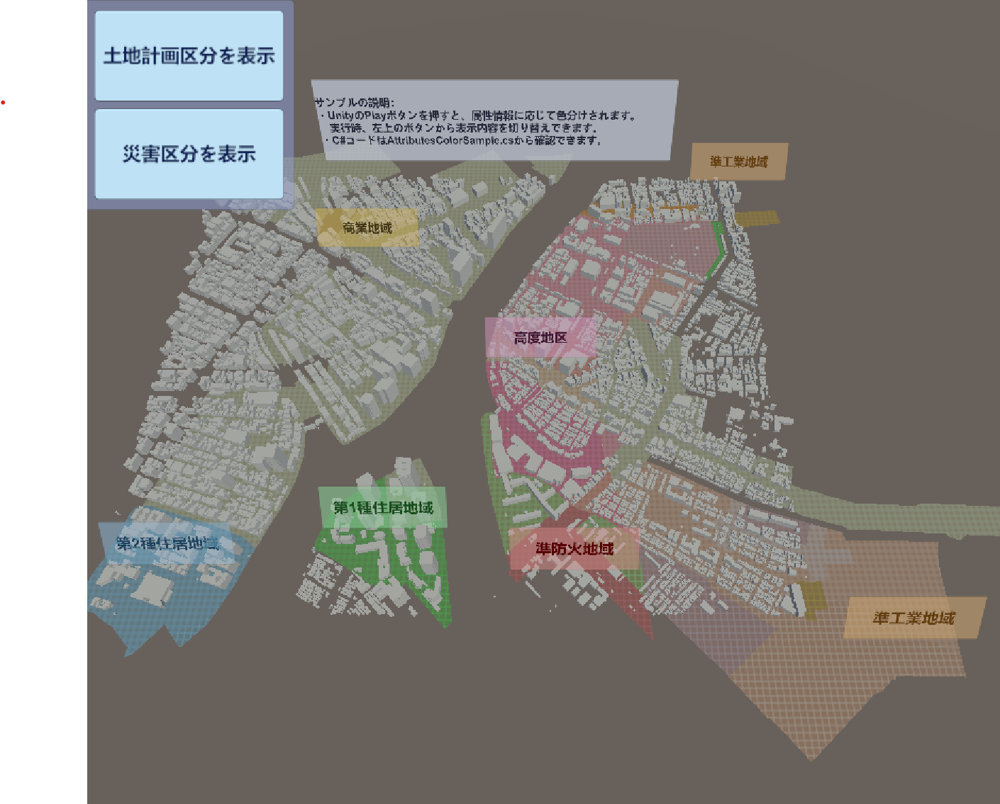

# 属性情報によって色分けする

このサンプルでは、土地計画決定情報および建物の水害時の想定浸水高に関する属性情報を読み取り、それに応じてランタイムで色を変えます。  

## サンプルを開く
このサンプルは次の場所にあります：  
```(PLATEAU SDKのサンプルディレクトリ)/AttributesColorSample/AttributesSample.unity```  
サンプルシーンを開き、Unityの再生ボタンを押すと地域ごとに色が付きます。  
なお、実行には時間がかかる場合があります。

属性情報を読み取り、色を変えるスクリプトは次の場所にあります:  
```(PLATEAU SDKのサンプルディレクトリ)/AttributesColorSample/AttributesColorSample.cs```

## サンプルコード

### サンプルコード全文
属性情報に応じて色分けするサンプルコード、`AttributesColorSample.cs`の内容は以下のとおりです。

```csharp
using System.Collections;
using System.Collections.Generic;
using PLATEAU.CityInfo;
using UnityEngine;

/// <summary>
/// ランタイムで、PLATEAUの属性情報に応じて色を分けるサンプルです。
/// </summary>
public class AttributesColorSample : MonoBehaviour
{
    /// <summary> 色分けしたいターゲットを指定します。 </summary>
    [SerializeField] private Transform targetParent;
    private void Start()
    {
        // PLATEAUCityObjectGroupコンポーネントに属性情報が格納されており、ランタイムで読み込むことができます。
        var cityObjGroups = targetParent.GetComponentsInChildren<PLATEAUCityObjectGroup>();
        foreach(var cityObjGroup in cityObjGroups)
        {
            var target = cityObjGroup.transform;
            foreach (var cityObj in cityObjGroup.GetAllCityObjects())
            {
                // 属性情報（キーバリューペアが集まったもの）を取得します。
                var attributes = cityObj.AttributesMap;
                
                // 属性情報のうち、土地計画上の区分を取得して色分けします。
                if (attributes.TryGetValue("urf:function", out var landFuncAttr))
                {
                    string landFuncName = landFuncAttr.StringValue;
                    var color = ColorByLandFuncName(landFuncName);
                    ChangeMaterialByColor(target, color);
                }
                
                // 属性情報のうち、水害時の想定浸水高さを取得します。
                if (attributes.TryGetValue("uro:buildingDisasterRiskAttribute", out var disasterRiskAttr))
                {
                    if (disasterRiskAttr.AttributesMapValue.TryGetValue("uro:depth", out var depthValue))
                    {
                        var depth = depthValue.DoubleValue;
                        var color = ColorByDepth(depth);
                        ChangeMaterialByColor(target, color);
                    }
                }
                
            }
        }
    }

    private Color ColorByLandFuncName(string landFuncName)
    {
        Color matColor = Color.white;
        
        if (landFuncName.Contains("第1種住居地域"))
        {
            matColor = new Color(0.1f, 0.8f, 0.1f);
        }
        else if (landFuncName.Contains("第2種住居地域"))
        {
            matColor = new Color(0.3f, 0.7f, 0.9f);
        }
        else if (landFuncName.Contains("商業地域"))
        {
            matColor = new Color(0.8f, 0.8f, 0.5f);
        }
        else if (landFuncName.Contains("高度地区"))
        {
            matColor = new Color(0.8f, 0.5f, 0.5f);
        }
        else if (landFuncName.Contains("準工業地域"))
        {
            matColor = new Color(0.8f, 0.5f, 0f);
        }
        else if (landFuncName.Contains("準防火地域"))
        {
            matColor = new Color(0.9f, 0.1f, 0.4f);
        }
        else if (landFuncName.Contains("防火地域"))
        {
            matColor = new Color(0.9f, 0.2f, 0.2f);
        }

        return matColor;
    }

    private Color ColorByDepth(double depth)
    {
        float t = (float)depth / 3f;
        return Color.Lerp(Color.blue, Color.red, t);
    }

    private void ChangeMaterialByColor(Transform target, Color color)
    {
        var meshRenderer = target.GetComponent<MeshRenderer>();
        if (meshRenderer == null) return;
        var material = new Material(meshRenderer.material)
        {
            color = color
        };
        meshRenderer.material = material;
    }
    

}

```

### サンプルコード解説
上のコードを解説します。  
属性情報を取得するには、まず各地物ゲームオブジェクトに対してインポート時に付与される`PLATEAUCityObjectGroup`コンポーネントにアクセスします。

```csharp
// コンポーネントにアクセスするところから始めます。
var cityObjGroups = targetParent.GetComponentsInChildren<PLATEAUCityObjectGroup>();
foreach(var cityObjGroup in cityObjGroups)
{
    // ここで各コンポーネントに保存されている属性情報にアクセスします。
}
```

コンポーネント内に地物に関する情報が保存されています。  
インポート時に地域単位に設定した場合、  
1つのコンポーネントの中に複数の地物情報(`CityObject`)が入っています。  
主要地物単位、または最小地物単位の場合は`CityObject`は1つです。  
いくつであっても、`cityObjectGroup.GetAllCityObjects()`で`CityObject`を取得できます。

```csharp
foreach (var cityObj in cityObjGroup.GetAllCityObjects())
{
    // ここでCityObjectにアクセスします。
}
```
`CityObject`から属性情報にアクセスしたり、地物型が何であるかを取得したりできます。

```csharp
// 属性情報（キーバリューペアが集まったもの）を取得します。
var attributes = cityObj.AttributesMap;
```

属性情報はキーとバリューのペアが集まったものです。  
バリューの型は、`String`型または入れ子の`AttributesMap`(キーバリューの組が集まったもの)  
のどちらかであり、対応するgetterで値を取得できます。  
なお、Double型など他の型のgetterもありますが、内部的には単にStringをパースしたものです。  
下はString型の属性情報を取得する例です。
```csharp
// 属性情報のうち、土地計画上の区分を取得して色分けします。
if (attributes.TryGetValue("urf:function", out var landFuncAttr))
{
    string landFuncName = landFuncAttr.StringValue;
    var color = // ここを"第1種住居地域"など属性情報の値に応じて場合分けで設定
    ChangeMaterialByColor(target, color);
}
```

下は、属性情報が入れ子になっているパターン（バリューがキーバリューセットである）ときに値を取得する例です。  
`uro:buildingDisasterRiskAttribute`をキーとする入れ子で、キー`uro:depth`の値を取得しています。
```csharp
// 属性情報のうち、水害時の想定浸水高さを取得します。
if (attributes.TryGetValue("uro:buildingDisasterRiskAttribute", out var disasterRiskAttr))
{
    if (disasterRiskAttr.AttributesMapValue.TryGetValue("uro:depth", out var depthValue))
    {
        var depth = depthValue.DoubleValue; // stringをdoubleにパースした値を取得します。
        var color = ColorByDepth(depth);
        ChangeMaterialByColor(target, color);
    }
}
```

属性値に応じてマテリアルのMainColorを変えることで、属性情報を可視化できます。
```csharp
// マテリアルの色を変えます。
private void ChangeMaterialByColor(Transform target, Color color)
{
    var meshRenderer = target.GetComponent<MeshRenderer>();
    if (meshRenderer == null) return;
    var material = new Material(meshRenderer.material)
    {
        color = color
    };
    meshRenderer.material = material;
}
```