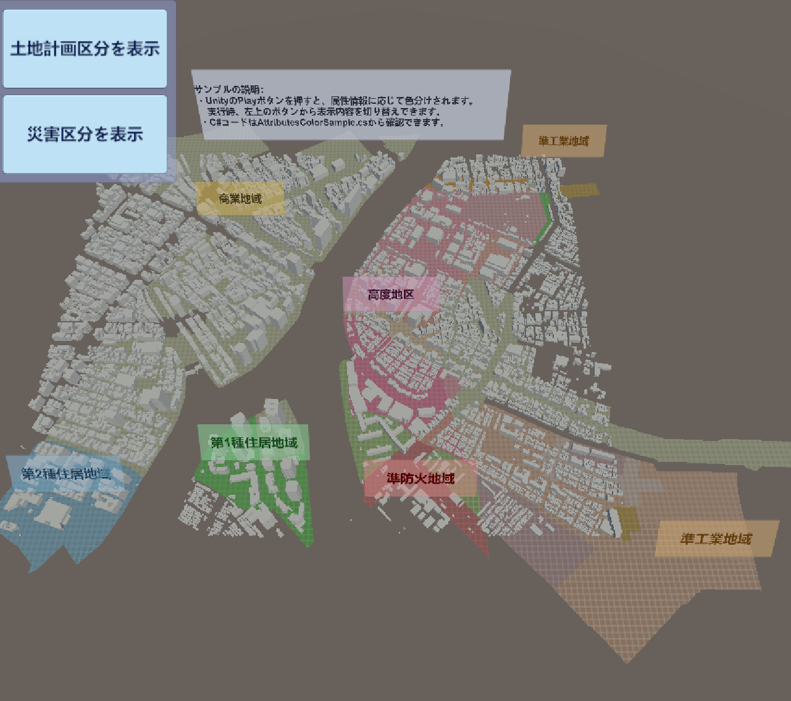

# 属性情報によって色分けする

このサンプルでは、土地計画決定情報に関する属性情報を読み取り、それに応じてランタイムで色を変えます。  

このサンプルは次の場所にあります：  
```(PLATEAU SDKのサンプルディレクトリ)/AttributesColorSample/AttributesSample.unity```  
サンプルシーンを開き、Unityの再生ボタンを押すと地域ごとに色が付きます。  
なお、実行には時間がかかる場合があります。

属性情報を読み取り、色を変えるスクリプトは次の場所にあります:  
```(PLATEAU SDKのサンプルディレクトリ)/AttributesColorSample/AttributesColorSample.cs```

このスクリプトでは、都市の各ゲームオブジェクトに付与されているコンポーネントである`PLATEAUCityObjectGroup`から情報を読み取ります。  
同コンポーネントから`CityObject`を取得し、そこから属性情報である`AttributesMap`にアクセスできます。  
詳しくはスクリプトを参照してください。
