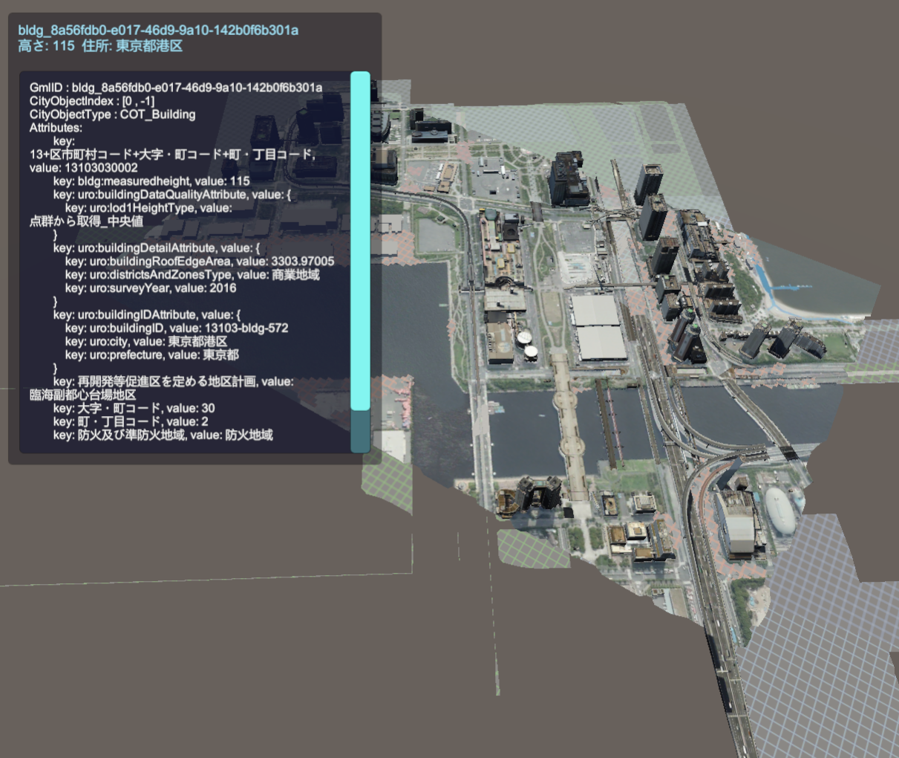

# 属性情報を表示する

このサンプルを再生して地物をクリックすると、その属性情報が画面に表示されます。  

このサンプルは次の場所にあります：  
```(PLATEAU SDKのサンプルディレクトリ)/AttributesDisplaySample/AttributesDisplaySample.unity```
  
サンプルスクリプトは次の場所にあります：
```(PLATEAU SDKのサンプルディレクトリ)/AttributesDisplaySample/Scripts```  
- ClickToShowAttributes.cs
  - クリックされた地物の情報を取得し、UIに送ります。
  - クリックされた地物に付与されている`PLATEAUCityObjectGroup`から`CityObject`を取得し、`cityObj.DebugString()`で文字列にします。
- AttributesDisplay.cs
  - 情報表示のUIを制御します。  

詳しくはスクリプトを参照してください。