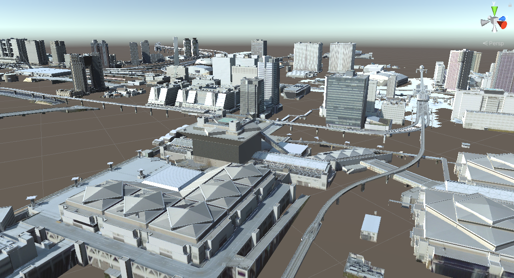
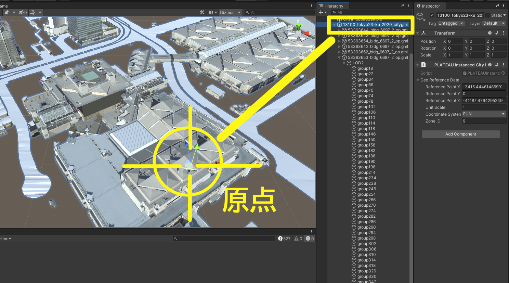
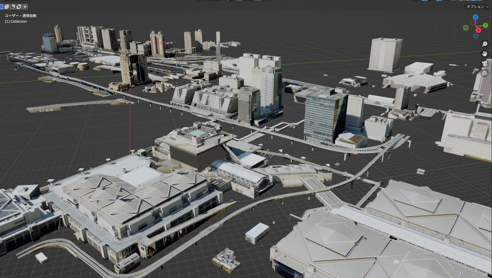

# 都市モデルのエクスポート
Unityのシーンに配置された都市の3Dモデルを、objファイルや gltfファイルとしてエクスポートできます。  
このページではエクスポートの手順を説明します。

## 前提
Unityのシーンに都市モデルがインポートされていることが前提です。  
インポートの方法については [都市モデルのインポート](ImportCityModels.md) をご覧ください。  

## エクスポート手順
### エクスポート対象の指定
- Unityのメニューバーから `PLATEAU → PLATEAU SDK` を選択します。   
  表示されるウィンドウの上部に3つのタブ「インポート、モデル調整、エクスポート」があります。  
  このうちエクスポートを選択します。  
    
  
    
- `選択オブジェクト` からエクスポート対象を選択します。
  - 対象として選択できるのはインポート時に生成されたゲームオブジェクトのうち、  
    親子関係における最上位のものです。
  - 親子関係の最上位には自動で `PLATEAUInstancedCityModel` コンポーネントが付与されています。  
    このコンポーネントを持つゲームオブジェクトが選択対象となります。
- 出力形式を選択します。
  - OBJ形式か、GLTF形式かを選択します。
  - ただし、OBJ形式はフォーマットの仕様上、後述の技術的な制約があります。

### 出力オプションの設定

オプションの設定項目について説明します。

- **GLTFフォーマット**

  - 出力形式がGLTFのときのみ表示される設定項目です。  
    フォーマットを次から選択します。
  - **GLTF**
    - 3Dモデル、テクスチャ、binファイルを別々のファイルとするフォーマットです。 
  - **GLB**
    - 3Dモデルとその関連データをまとめて1つのファイルとするフォーマットです。
    
- **テクスチャ**
  - 出力にテクスチャを含めるかどうかを設定します。チェックが付いていれば含みます。
  
- **非アクティブオブジェクトを含める**

  - ヒエラルキー上で非アクティブになっているゲームオブジェクトを含めるかどうかを設定します。
  - チェックが外れているとき、非アクティブなものを出力から除外します。
  - ここでいう `非アクティブ` とは、下図のチェックマークが自身または親において外れており、  
    ヒエラルキービュー上で文字色が薄くなっている状態を指します。  
    
    
    
- `座標変換`
  - 座標の基準点を設定します。
  - `Local` (ローカル) のとき:
    - ポリゴンの座標は `PLATEAUInstancedCityModel` の位置を原点とした座標で表されます。  
      
      
  - `Plane Cartesian` (直交座標系) のとき: 
    - ポリゴンの座標は、国土交通省が定める直交座標系のうち、インポート時に選択した直交座標系を原点とするよう平行移動されます。  
        
      上図は [国土地理院のWebサイト「わかりやすい平面直角座標系」](https://www.gsi.go.jp/sokuchikijun/jpc.html) より引用  
      (原点マークは別途追記)
  - 2つの使い分けについて
    - 原点付近に3Dモデルが来るようにしたいときは Local
    - 原点から遠い位置に3Dモデルが配置されますが、複数の異なる都市をエクスポートするときに位置の整合性を取りたいときは Plane Cartesian が利用できます。
- `座標軸`
  - エクスポートした objファイルを Unityにインポートしたい場合は、  
    後述の理由で WUN を指定してください。
  - **座標軸設定の趣旨:**
  - x,y,z 軸がどの方向を向いているかはアプリケーションによって異なりますが、  
    この設定項目によって座標軸の違いに合わせて変換できます。
  - 座標軸の名称はアルファベット3文字で表され、  
    (1文字目,2文字目,3文字目) が (x軸,y軸,z軸) の向きを表します。
  - 例えば、Unityでは x軸が東(East), y軸が上(Up), z軸が北(North) を向くので、  
    頭文字をとって EUN が Unityの座標系となります。
  - ただし、Unity向けに objをエクスポートするときは、  
    後述の理由で EUN ではなく WUN が正しい指定となります。
  - W は 西(West) を表します。

>[!NOTE]
> **OBJファイルの技術的制約について**  
>   
> OBJファイルはそのフォーマットの仕様上、制約があります。  
>   
> 1. オブジェクトが分割されず、1つのオブジェクトとして出力されます。  
>    その代わり、頂点グループとしてオブジェクト内で領域分けされます。  
>    例えば、Blenderの場合、インポート時に `頂点グループ` にチェックを入れると、図のように頂点グループが設定されます。  
>    
>     
> 3. objファイルを Unity にインポートするとき、左右が反転します。これを防ぎたい場合は、座標系WUNで出力してください。  
>    これは Unity の仕様によるものです。  
>    Unityの座標系は EUN ですが、EUNで出力した objファイルをインポートすると左右反転したモデルになります。  
>    そこで EUN を左右反転させた座標系である WUN で出力すると、Unityにインポートしたときに正しくなります。  
>    このようになる理由は、Unityは objファイルを右手座標系であると解釈し、Unityの左手座標系に合わせるために x座標の正負を反転させるためです。  

### エクスポート
- 出力先のフォルダを指定します。
- `エクスポート` ボタンを押してしばらく待ちます。
- 指定のフォルダに3Dモデルファイルが出力されます。

  
上図はエクスポートしたobjファイルを Blender で読み込んだものです。

>[!NOTE]
> **エクスポートした3Dモデルを再度Unityに取り込む場合**  
>  
> テクスチャ込みでエクスポートしたものを再度Unityにインポートする場合は、  
> 3Dモデルファイルとそれに対応するテクスチャフォルダを複数選択して  
> Unityのプロジェクトビューにドラッグ＆ドロップしてインポートしてください。