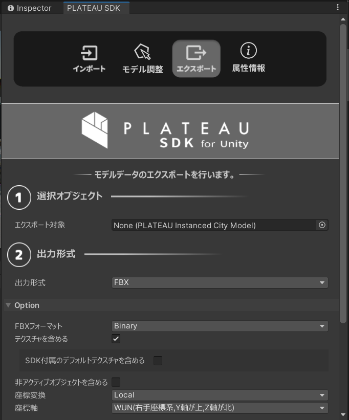

# 都市モデルのエクスポート
Unityのシーンに配置された都市の3Dモデルを、objファイルや gltfファイルとしてエクスポートできます。  
このページではエクスポートの手順を説明します。

## 前提
Unityのシーンに都市モデルがインポートされていることが前提です。  
インポートの方法については [都市モデルのインポート](ImportCityModels.md) をご覧ください。  

## エクスポート手順
### エクスポート対象の指定
- Unityのメニューバーから `PLATEAU → PLATEAU SDK` を選択します。   
  表示されるウィンドウの上部に3つのタブ「インポート、モデル調整、エクスポート」があります。  
  このうちエクスポートを選択します。  
    
  
    
- `選択オブジェクト` からエクスポート対象を選択します。
  - 対象として選択できるのはインポート時に生成されたゲームオブジェクトのうち、  
    親子関係における最上位のものです。
  - 親子関係の最上位には自動で `PLATEAUInstancedCityModel` コンポーネントが付与されています。  
    このコンポーネントを持つゲームオブジェクトが選択対象となります。
- 出力形式を選択します。
  - ファイル形式をFBX,OBJ,GLTFから選択できます。

### 出力オプションの設定

オプションの設定項目について説明します。

- **GLTFフォーマット**

  - 出力形式がGLTFのときのみ表示される設定項目です。  
    フォーマットを次から選択します。
  - **GLTF**
    - 3Dモデル、テクスチャ、binファイルを別々のファイルとするフォーマットです。 
  - **GLB**
    - 3Dモデルとその関連データをまとめて1つのファイルとするフォーマットです。
    
- **テクスチャを含める**
  - 出力にテクスチャを含めるかどうかを設定します。チェックが付いていれば含みます。

- **SDK付属のデフォルトテクスチャを含める**
  - 「テクスチャを含める」がオンのときのみ表示される設定項目です。
  - オフの場合、PLATEAU SDK付属のデフォルトマテリアルがマテリアルなしに置き換わって出力されます。
  - SDK付属のデフォルトマテリアルのテクスチャは、SDK付属のTriplanarシェーダーでのみ動作することを想定しています。  
    そのためデフォルトではオフとしています。
  
- **非アクティブオブジェクトを含める**

  - ヒエラルキー上で非アクティブになっているゲームオブジェクトを含めるかどうかを設定します。
  - チェックが外れているとき、非アクティブなものを出力から除外します。
  - ここでいう `非アクティブ` とは、下図のチェックマークが自身または親において外れており、  
    ヒエラルキービュー上で文字色が薄くなっている状態を指します。  
    
    
    
- `座標変換`
  - 座標の基準点を設定します。
  - `Local` (ローカル) のとき:
    - ポリゴンの座標は `PLATEAUInstancedCityModel` の位置を原点とした座標で表されます。  
      
      
  - `Plane Cartesian` (直交座標系) のとき: 
    - ポリゴンの座標は、国土交通省が定める直交座標系のうち、インポート時に選択した直交座標系を原点とするよう平行移動されます。  
        
      上図は [国土地理院のWebサイト「わかりやすい平面直角座標系」](https://www.gsi.go.jp/sokuchikijun/jpc.html) より引用  
      (原点マークは別途追記)
  - 2つの使い分けについて
    - 原点付近に3Dモデルが来るようにしたいときは Local
    - 原点から遠い位置に3Dモデルが配置されますが、複数の異なる都市をエクスポートするときに位置の整合性を取りたいときは Plane Cartesian が利用できます。
- `座標軸`
  - 選択したファイル形式がFBXまたはOBJの場合に表示されます。
  - X,Y,Z軸の向きを決めます。利用したいアプリケーションに応じて選択してください。
  - 例えば、エクスポートしたファイルをUnityにインポートしたい場合は、Y軸が上を指す座標軸を選択してください。
  - GLTF形式の場合は、仕様で座標軸が決まっているため、この設定項目は表示されません。

- `FBXフォーマット`
  - 出力形式がFBXのときのみ表示される設定項目です。
  - FBXを扱うご利用のソフトウェアに応じて選択してください。
  - BlenderやUnityでご利用あればBinaryを推奨します。

### エクスポート
- 出力先のフォルダを指定します。
- `エクスポート` ボタンを押してしばらく待ちます。
- 正常終了の場合、指定のフォルダに3Dモデルファイルが出力され、そのフォルダが開きます。  
  異常終了の場合、ダイアログが表示されます。

  
上図はエクスポートしたobjファイルを Blender で読み込んだものです。

## エクスポートの仕様
- OBJファイルはそのフォーマットの仕様上、次の制約があります。  
  - オブジェクトが分割されず、1つのオブジェクトとして出力されます。  
    その代わり、頂点グループとしてオブジェクト内で領域分けされます。  
    例えば、Blenderの場合、インポート時に `頂点グループ` にチェックを入れると、図のように頂点グループが設定されます。  
    
- Unity内でのTransform情報（Position, Rotation, Scale）はエクスポートしたファイルに反映されます。
  - FBX,GLTFの場合は、ノードとしてUnityのPosition, Rotation, Scale, および親子関係が反映されます。
  - OBJの場合は、OBJの仕様上親子関係が反映されないため、頂点座標が直接Position, Rotation, Scaleにより変形されて出力されます。

>[!NOTE]
> **エクスポートした3Dモデルを再度Unityに取り込む場合**  
>  
> テクスチャ込みでエクスポートしたものを再度Unityにインポートする場合は、  
> 3Dモデルファイルとそれに対応するテクスチャフォルダを複数選択して  
> Unityのプロジェクトビューにドラッグ＆ドロップしてインポートしてください。  
> 複数選択による同時インポートでないと、テクスチャが正しく適用されない場合があります。