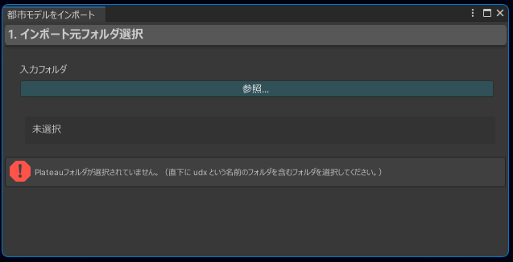
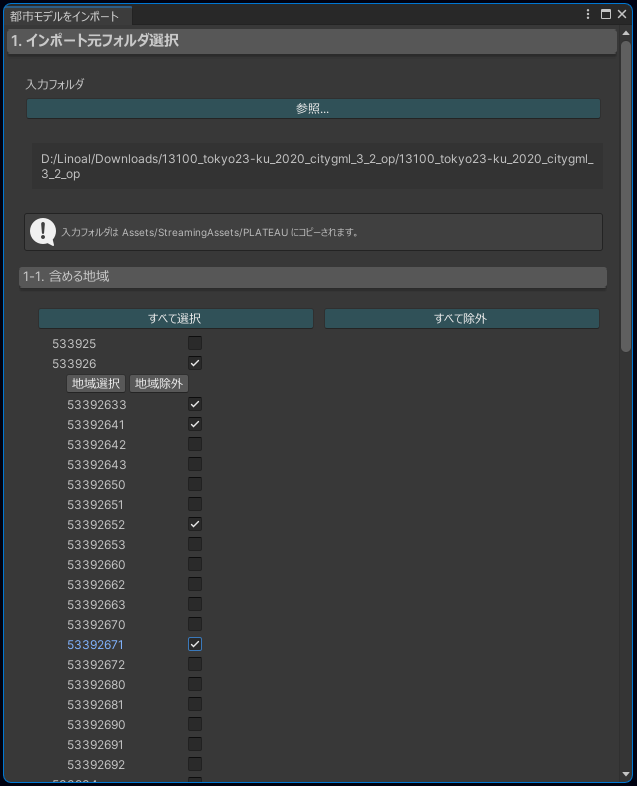
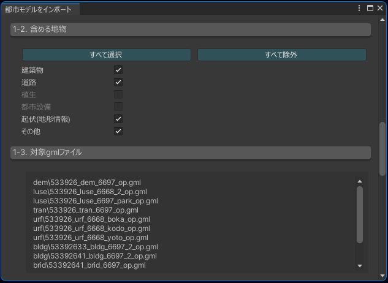
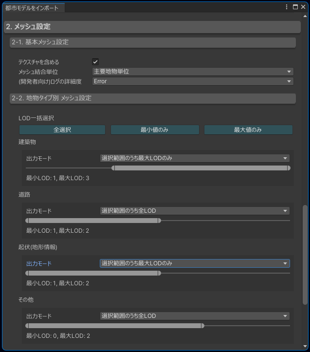
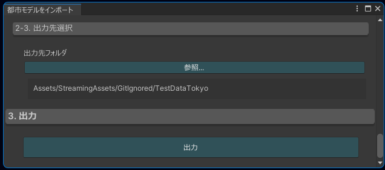
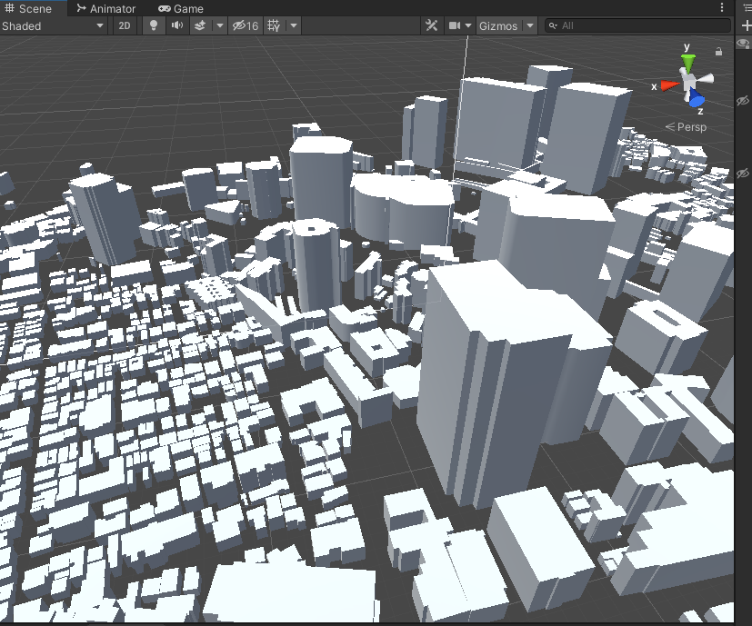
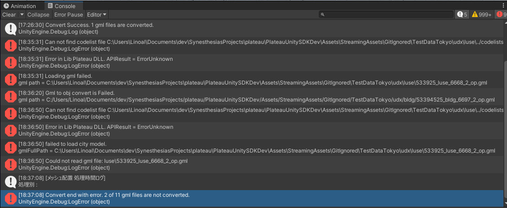

# 都市モデルのインポート

このページでは、都市データをUnityプロジェクトにインポートする手順を説明します。

## 準備
- 都市データを用意します。   
  これは国土交通省のPLATEAUのWebサイトからダウンロードできます。  
- PlateauSDK を導入したUnityプロジェクトを用意します。  
  SDKの導入方法は [インストール](Installation.md) を参照してください。

## インポート手順
### インポート元の選択
- Unityのメニューバーから ```PLATEAU → 都市モデルをインポート``` を選択します。   
  するとインポートウィンドウが表示されます。

- ```参照```ボタンから都市データのフォルダを選択します。   
  都市データのフォルダは、中に ```udx```, ```codelists```という名称のフォルダがあるはずです。

### インポート対象の絞り込み
- インポートする対象を選択します。  
  地域IDと地物タイプのチェックボックスで対象を絞り込むことができます。

#### 地域IDの選択
- 地域IDの選択では下図のように、まず6桁の地域IDにチェックを入れます。  
  するとそれよりも細かい区分である 8桁の地域IDのチェックボックスが表示されます。  

  - 地域IDを確認するには、ダウンロードしたフォルダに付属している ```indexmap``` という名前のpdfファイルをご覧ください。  
  下図のように地図上に地域IDが記載されています。
    

#### 地物タイプの選択
- インポートしたい地物のタイプについて、下図のようにチェックマークを入れてください。  
  灰色になり選択できないタイプは、データの中に含まれていないタイプです。
- ```1-3. 対象gmlファイル```の中には、選択した地域IDと地物タイプに合致するgmlファイルのリストが表示されます。



### 変換設定
3Dモデルのメッシュに関する変換設定をします。  


#### 基本メッシュ設定
 
- **テクスチャを含める**
  - チェックマークを入れるとテクスチャも合わせて出力されます。 
- **メッシュ結合単位**
  - **主要地物単位**
    - メッシュは建物ごとに分かれて出力されます。
    - 建物ごとに地物データを取得できるようにしたい場合はこちらを選択します。
  - **最小地物単位**
    - 屋根、壁単位など非常に細かくオブジェクトを分けたい場合はこちらを選択します。  
  - **都市モデル地域単位**
    - メッシュは1つに結合されて出力されます。
    - オブジェクト数を削減して軽量化できますが、建物ごとの地物データは取得不可になります。

#### 地物タイプ別 メッシュ設定
- 地物タイプ別に、出力するLODを選択します。

>[!NOTE]
> **LODとは**  
> gmlファイルの中には、都市モデルの形状の細かさを変えたいという需要に対応するため、  
> 複数の形状データが格納されている場合があります。  
> LOD0がもっとも大雑把な形状で、LOD1, LOD2 と数字が上がるほど細かい形状になります。  
> 建築物の場合、LOD0 は平面、LOD1は平面に一定の高さを付けたもの、LOD2はより細かい形状です。

- **出力モード**
  - **選択範囲のうち全LOD**
    - スライダーで選択したLOD範囲のうち、データがあるLOD形状をすべて出力します。
  - **選択範囲のうち最大LODのみ**
    - スライダーで選択したLOD範囲のうち、データがある中で最大のLOD形状を1つ出力します。
  - **LODスライダー**
    - ドラッグで動かしてLODの範囲を指定します。
  
### 出力先選択とインポートの実行


- 3Dモデルファイルとメタデータの出力先を指定します。
  出力先はUnityプロジェクトのAssetsフォルダの内部である必要があります。  
  ここで選択したフォルダに、 gml ファイルを変換した 3Dモデル(.obj形式)ファイル および メタデータが出力されます。

>[!NOTE]
>   ここで選択したフォルダとは別に、インポート元となる都市データも合わせてUnityプロジェクト内にコピーされます。  
>   こちらのコピー先は、上の設定に関わらず ```Assets/StreamingAssets/PLATEAU``` になります。  
>   こうする意図は、Unityアプリケーションの実行中にgmlファイルのデータを取得する目的で、gmlファイルを StreamingAssetsフォルダに配置する必要があるためです。  
>   なお、インポート対象として選択したものに関連するもののみがコピーされます。

- ```出力```ボタンを押してインポートを実行します。
- 出力結果を確認します。
   - 3Dモデルファイル(.obj形式)が指定した出力先に生成されます。
   - 変換したモデルがUnityのシーンに自動で配置されます。
   - 変換元ファイルが ```Assets/StreamingAssets/PLATEAU``` にコピーされています。
   - メタデータが出力先に配置されます。


>[!NOTE]
> メタデータを選択すると再変換の画面がインスペクタに表示されます。  
> メタデータはインポート時の設定を覚えているので、「設定を少し変えて再変換」する操作が便利にできるようになっています。  
> また、再変換時はシーンに配置されたモデルも置き換わります。  
> 変換せずにLODを指定して再配置するオプションもあります。


### エラーログの確認

ロードに失敗したgmlファイルがある場合、Unityのコンソールにエラーログが出力されます。  
そのような場合でも、一部のgmlファイルのロードが成功していれば、そのgmlに関しては正常にインポートされています。  
複数のエラーログが出力されるので、その見方をこの項で説明します。

- 失敗・成功の件数を確認するには
  - 複数あるエラーログのうち、最後のものを確認すると次のメッセージがあります。  
    ```Convert end with error. (失敗件数) of (全体件数) gml files are not converted.```  
    これにより失敗件数が分かります。また、残りのgmlファイルは正常にインポートできたことが分かります。
- どのgmlファイルでなぜ失敗したのか確認するには
  - 次のエラーメッセージで、どのgmlファイルで失敗したかを確認できます。  
    ```Loading gml failed. gml path =(gmlファイルの場所)``` または  
    ```Gml to obj convert is Failed. gml path =(gmlファイルの場所)```  
  - 上記のエラーログの直前のエラーは、通常そのgmlファイルのロードに失敗した理由を示します。