# 都市モデルのインポート

このページでは、都市データをUnityプロジェクトにインポートする手順を説明します。

## 準備
- PlateauSDK を導入したUnityプロジェクトを用意します。  
  SDKの導入方法は [インストール](Installation.md) を参照してください。

## インポート手順
### インポート元の選択
- Unityのメニューバーから `PLATEAU → PLATEAU SDK` を選択します。   
  表示されるウィンドウの上部に4つのタブ「インポート、モデル調整、エクスポート、属性情報」があります。  
  このうちインポートを選択します。
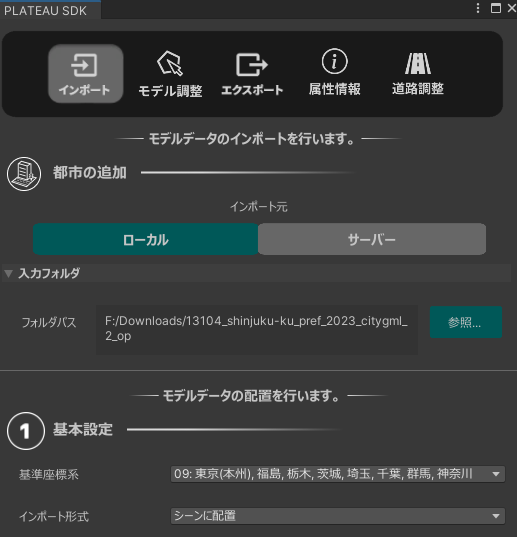
- インポート先で`ローカル`または`サーバー`を選択します。

#### ローカルからインポートする場合

- 導入したい都市データが自分のコンピュータにある場合はローカルを選択します。  
  3D都市モデルは [G空間情報センターのPLATEAUポータルサイト](https://www.geospatial.jp/ckan/dataset/plateau) からダウンロードできます。  
  CityGML形式のものをダウンロードしてください。
  - `参照`ボタンを押します。都市データのフォルダの選択画面が表示されます。
  - 都市データのフォルダの中には、`udx`,`codelists`という名前のフォルダがあるはずです。  
    `udx`から**階層が1つ上**のフォルダを選択します。

#### サーバーからインポートする場合

- `サーバー`では、PLATEAUのデータサーバーから直接 都市データをインポートできます。
  - `接続先設定`を開くことができますが、設定しなくとも自動でデフォルトのURLに接続されます。  
    別のURLに接続したい場合のみ、URLを入力して「再接続」ボタンを押してください。  
    `認証トークン` は Bearer認証のトークンです。  
  
    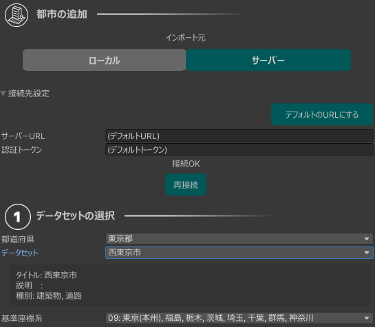
  - `データセットの選択`で`都道府県`を選択します。
  - するとその都道府県に対応する `データセット`が選択肢に出てくるので選びます。

### 基準座標系の選択
リストのうち、都市が属する場所として近いものを選択します。  
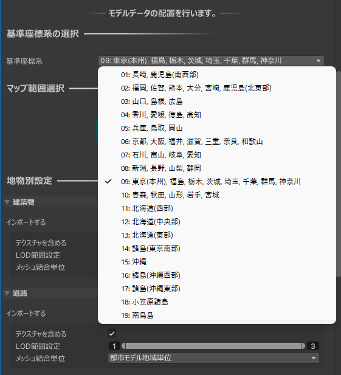   
適切なものを選ぶと座標の誤差が小さくなります。  
ここで選択する座標系は国土交通省が定める平面直角座標系に準拠しています。  
詳しくは [国土地理院のWebサイト「わかりやすい平面直角座標系」](https://www.gsi.go.jp/sokuchikijun/jpc.html) をご覧ください。

### インポート範囲の選択
- `範囲選択`ボタンを押します。
- 現在のUnityシーンに変更がある場合、変更を保存するかどうかを尋ねるダイアログが表示されます。  
  `Save` または `Don't Save` をクリックします。
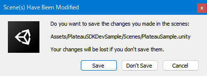
- シーンビューの表示が切り替わり、範囲選択画面になります。
  
- 範囲選択画面の操作方法
  - マウスホイールを上下に回してズームアウト、ズームインします。
  - マウスホイールを押し込んだままドラッグしてカメラ移動します。
  - 範囲の選択方法については、画面右下に説明があるとおり、
    - クリックで選択/選択解除
    - ドラッグで矩形での選択追加
    - Shift+ドラッグで矩形での選択除外をします。
  - シーンビュー左上の`決定`ボタンを押して範囲を確定します。すると元のシーンに戻ります。
- 画面のみかた
  - 青色の線は利用可能な地域を示します。
  - 地域ごとに利用可能なGML種別と対応LODがアイコン形式で表示されます。
    - 対応LODは色で表現されます。画面左下の凡例の色と対応します。
  - アイコンが多すぎると感じる場合は、画面左下の凡例のチェックを切り替えることでアイコンの表示/非表示をLODごとに切り替えることができます。
  - 地図は国土地理院のサイトから自動でダウンロードされて表示されます。インターネットへの接続が必要です。
  - 区域に表示される番号は、後述の`indexmap.pdf` に記載の番号と同じです。
- メッシュコード検索機能
  - シーンビュー左上の`メッシュコード検索`ボタンを押すと、メッシュコードの番号（地図上で青色で表示される数字）で検索できます。
  - 番号を入力してOKボタンを押すと、その範囲に視界が移動します。

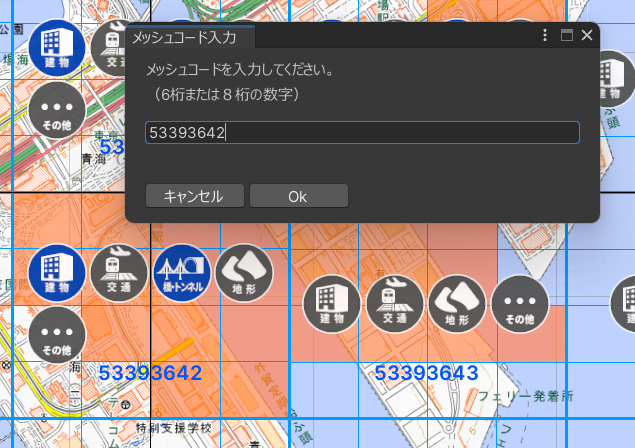

> [!NOTE]  
> 範囲選択画面では、通常はガイド線が格子状に並び、地図は隙間無く表示されます。  
> しかし、座標系の選択を誤ると、下図のようにガイド線の配置が歪み、地図に隙間ができます。
> 
> これは誤った座標系を選択したことによる座標計算の誤差が可視化されたものです。  
> 球体の地球を平面の地図で表現する都合上、基準座標点から離れるほど座標計算の誤差は大きくなります。

- 範囲選択が完了すると、`範囲選択` ボタンの下に `範囲選択:セット済` という表示がなされ、  
  その下に`地物別設定` が表示されるようになります。  
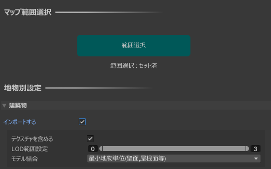
- **補足**:  
  地域の区分を確認したい時は、ローカルにダウンロードしたフォルダに付属している `indexmap` という名前のpdfファイルをご覧ください。  
下図のように地図上に区分が記載されています。
  

### 地物別設定
地物の種類ごとにインポートに関する設定を行います。  
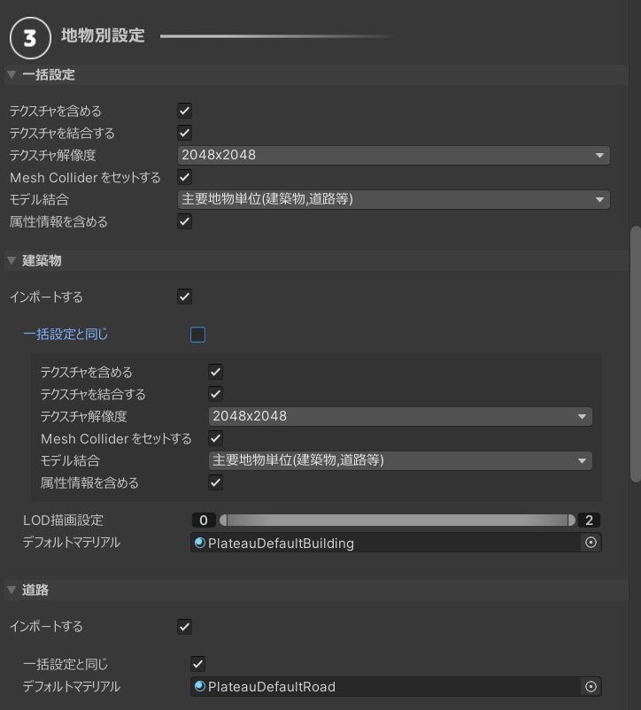  

#### 設定項目について:

- `一括設定`
  - 複数の地物タイプをまとめて設定したい場合に編集してください。 
  - 地物タイプごとの設定で「一括設定と同じ」を選択したときに、この設定が適用されます。
  - 「一括設定と同じ」のチェックを外したときは、一括設定にかかわらず、個別に設定を上書きするためのメニューが表示されます。
  - 各設定の意味については後述します。
- `インポートする`
  - チェックが付いている地物タイプのみインポートします。
- `テクスチャを含める`
  - テクスチャが存在する地物タイプで表示される設定項目です。  
    チェックが付いていて、かつテクスチャがある場合はそれを含めてインポートします。  
    都市データによってはテクスチャがない場合があり、  
    その場合はチェックを外した時と同様にデフォルトマテリアルが適用されます。
- `テクスチャを結合する`
  - テクスチャを含める場合、テクスチャを結合するかしないかを設定します。

>[!NOTE]
> **テクスチャ結合すると描画負荷が良くなります**  
>   
> PLATEAUのデータはテクスチャの枚数が多い傾向にあり、  
> 結合しないと描画負荷が高くなる傾向にあります。   
>   
> 結合機能を有効にすると、複数のテクスチャを1枚の画像にまとめ、  
> 3DモデルのUVも合わせて調整されます。  
> それによって描画負荷を改善できます。  
> 
> 例えば、新宿区の2km×2kmのデータについて  
> テクスチャ結合して4096×4096のテクスチャサイズにまとめたとき、  
> ドローコール数は4160から483に向上し、  
> あるPCではFPSが70から90に向上しました。
    
- `テクスチャ解像度`
  - テクスチャを結合する場合の、結合後のテクスチャの大きさを指定します。
- `Mesh Collider をセットする`
  - チェックが付いている場合、各モデルに Mesh Colliderが追加されます。
  - インポート後、クリックで属性情報を表示する機能を利用する場合、Mesh Colliderが必要です。
- `LOD描画設定`
  - 複数のLODを利用可能な地物タイプで表示される設定項目です。  
    バーの左端と右端をドラッグして、インポートするLODの範囲を指定できます。
- `モデル結合`
  - `主要地物単位（建築物,道路等）`
    - モデルのメッシュは建物ごとに結合されて出力されます。
    - 建物ごとに地物データを取得できるようにしたい場合はこちらを選択します。
  - `最小地物単位（壁面,屋根面等）`
    - 屋根、壁単位など非常に細かくオブジェクトを分けたい場合はこちらを選択します。
  - `地域単位`
    - モデルのメッシュは結合されて出力されます。
    - オブジェクト数を削減して軽量化できますが、建物ごとの地物データは取得不可になります。
    - メッシュの結合はある程度の大きさの範囲ごとに行われます。

>[!NOTE]
> **LODとは**  
> gmlファイルの中には、都市モデルの形状の細かさを指定したいという需要に対応するため、  
> 複数の形状データが格納されている場合があります。  
> LOD0がもっとも大雑把な形状で、LOD1, LOD2 と数字が上がるほど細かい形状になります。  
> 建築物の場合、LOD0 は平面、LOD1は平面に一定の高さを付けたもの、LOD2はより細かい形状です。
>
> なお、ここでいう LOD とは PLATEAU の仕様上の LOD を指します。  
> Unity の機能としての LOD とは異なる概念です。

- `属性情報を含める`
  - 有効化すると、地物の属性情報がシーン中にコンポーネントで保存されます。
  - 下図のように、PLATEAUCityObjectGroupコンポーネント内で属性情報が保持されます。
  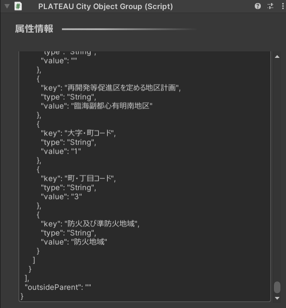
- `デフォルトマテリアル`
  - PLATEAUの3Dモデルのうち、テクスチャやマテリアル指定がない箇所のマテリアルを指定します。
  - デフォルトでは、地物タイプに応じたマテリアルが指定されています。

>[!NOTE]
> **地物の選択について**  
> 地物の中にはインポートに時間がかかるものもあるのでご注意ください。  
> 例えば 土地起伏 はデータの範囲が 10km × 10km と非常に広く、  
> データ容量が重く処理に時間がかかるのでご注意ください。

>[!NOTE]
> **現実の景観と異なる地物について**  
> 地物の種類で「土地利用」と「災害リスク」については、  
> 情報の範囲を示す目印として板状の3Dモデルが表示されます。   
> 土地利用と災害リスクに関するデータが不要な場合は  
> インポートしないか、インポート後オフにすることを推奨します。
>   
> 上図で赤い格子模様になっている板は、災害リスク範囲の目印です。
 
>[!NOTE]
> **道路の高さについて**  
> LOD1 の道路は、PLATEAUの仕様上、高さのデータを含みません。  
> したがって、インポートするとすべて高さ 0 で表現されます。  
> LOD2 以上の道路は高さが反映されます。

### 土地に衛星写真や地図を貼り付ける

土地に衛星写真や地図を貼り付けることができます。

#### 設定方法
- 範囲選択画面で土地起伏の3Dモデルが存在する地域を選択すると、インポート設定に「土地起伏」が表示されます。

- 土地起伏では、上述の地物別設定に加えて土地起伏専用の設定項目があります。
- `航空写真または地図を貼り付け`
  - チェックがONになっていると機能が有効化されます。
- `URL`
  - 航空写真または地図の画像をダウンロードするためのURLです。
  - デフォルトでは地理院地図の航空写真のURLが入力されています。
  - このURLを変更すれば、航空写真だけでなく、国土地理院が提供している多種多様な地図や写真を土地に貼り付けることができます。  
    利用できる地図については[国土地理院のページ](https://maps.gsi.go.jp/development/ichiran.html)を参照してください。  
    そのページに記載されているURLを貼り付けることで地図を利用できます。
  - 下図は地図を貼り付けた例です。
  
  - 下図は陰影起伏図を貼り付けた例です。
  
  - URLには文字列 `{z}, {x}, {y}`を含めるようにしてください。これは地図タイルのxyz座標に変換されます。
    - 地図タイルのxyz座標については[国土地理院のページ](https://maps.gsi.go.jp/development/siyou.html)を参照してください。 
    - SDKの機能により、土地の座標をもとに文字列`{z}, {x}, {y}`を適切な数値に置き換えて画像をダウンロードします。  
  - `ズームレベル`
    - 地図タイルのズームレベルです。
      - 数値が大きいほど高精細な画像になります。
      - 数値が1つ下がると、画素数が4分の1になります。
      - ズームレベルは、地図タイルxyz座標のzの値に相当します。
  - `利用可能なズームレベルの検索`
    - ボタンを押すと、現在入力されているURLでどのズームレベルが利用可能なのかを検索します。
    - 検索が完了すると、ズームレベルの入力欄がドロップダウンに変化し、利用可能なズームレベルから選択できるようになります。
    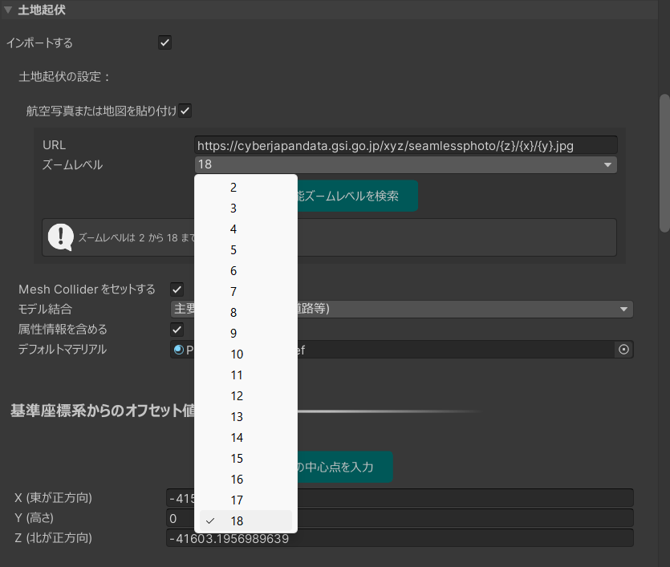
  
この機能でダウンロードされた地図タイルは、自動で1枚の画像に結合され、土地のUVとマテリアルが設定されてインポートされます。

### 基準座標系からのオフセット値の設定
3Dモデルの原点をどこに置くかを指定します。  
デフォルト値として、範囲選択画面で選択した範囲の中心が自動入力されるので、  
このままの値でインポート可能です。  
3Dモデルの原点位置を調整したい場合のみ値を編集してください。
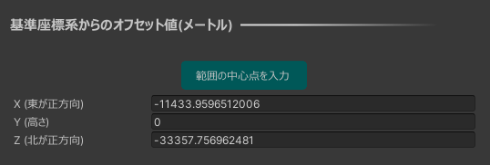  
**値の意味:**  
上のインポート設定で選択した「基準座標系」の原点から、  
東西・南北・高さ方向にそれぞれ何メートルの地点を3Dモデルの原点とするかを表します。  
基準座標系の原点は次の国土地理院のWebサイトで示されます:  
[国土地理院のサイト](https://www.gsi.go.jp/sokuchikijun/jpc.html)

### インポートの実行
- `モデルをインポート`ボタンを押します。
- ウィンドウを下にスクロールすると、インポート処理の進捗が表示されます。
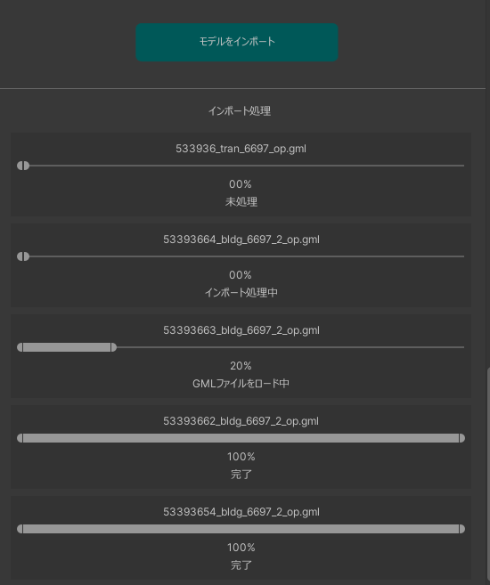
- 処理が進むと、都市のオブジェクトが順次シーンに配置されていきます。  
  進捗表示がすべて「完了」になったらインポート終了です。  
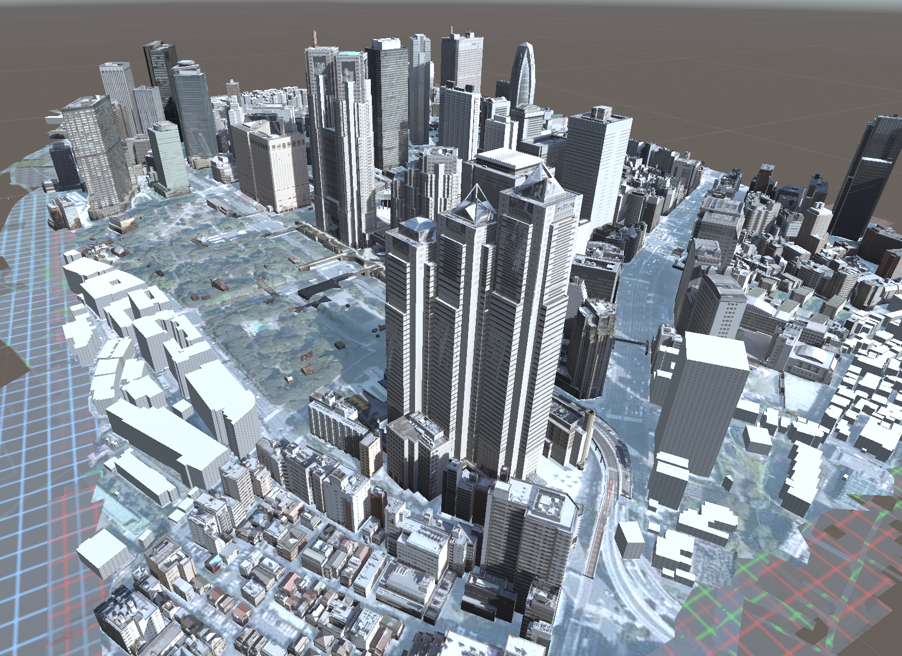

### インポートのキャンセル
- インポート処理中に`インポートをキャンセルする`ボタンを押します。
- キャンセル処理中は、ボタンが`キャンセル中…`の表記に変わります。
  再度`モデルをインポート`ボタンが表示されたらキャンセル完了です。

>[!NOTE]
>   インポート元となる都市データは `Assets/StreamingAssets/.PLATEAU` にコピーされます。  
>   .PLATEAU は隠しフォルダである点にご注意ください。Unityのインポート処理を削減する目的でこうなっています。
>   なお、インポート対象として選択したものに関連するもののみがコピーされます。

>[!NOTE]
>   インポートされた都市モデルは、プレハブ化するとメッシュとテクスチャが missing になってしまいます。  
>   データはシーンに埋め込まれているためです。  
>   プレハブ化またはモデルとテクスチャを別ファイルに分けたい場合は、エクスポート機能を利用して別ファイルに書き出してください。

配置されたゲームオブジェクト階層のトップには、コンポーネント`PLATEAUInstancedCityModel` がアタッチされます。  
このインスペクタから緯度、経度などの情報を確認できます。  
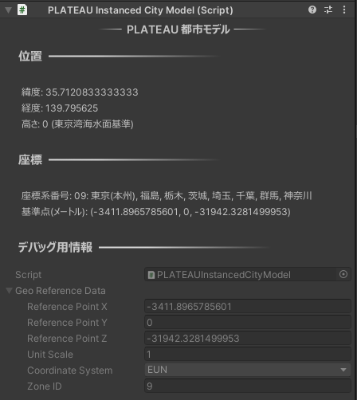

### エラーログの確認

インポートの結果、計算状況ウィンドウの内容がすべて「完了」となれば良いですが、  
ロードできなかったgmlファイルに関しては「失敗」と表示されます。  
そのような場合でも、他のgmlファイルのロードが成功していれば、そのgmlに関しては正常にインポートされています。  
失敗の場合は Unityのコンソールにエラーログが出力されます。

### インポートされた3Dモデルの保存先
インポートされた3Dモデルやテクスチャは、シーンファイルの中に直接保存されます。  
これによるシーンファイルの肥大化を改善したい場合は、  
モデル修正機能の「Assetsに保存」機能を利用してシーンからFBXに書き出すことができます。  
詳しくは[こちら](ModelAdjust.md#assetsに保存機能)をご覧ください。
