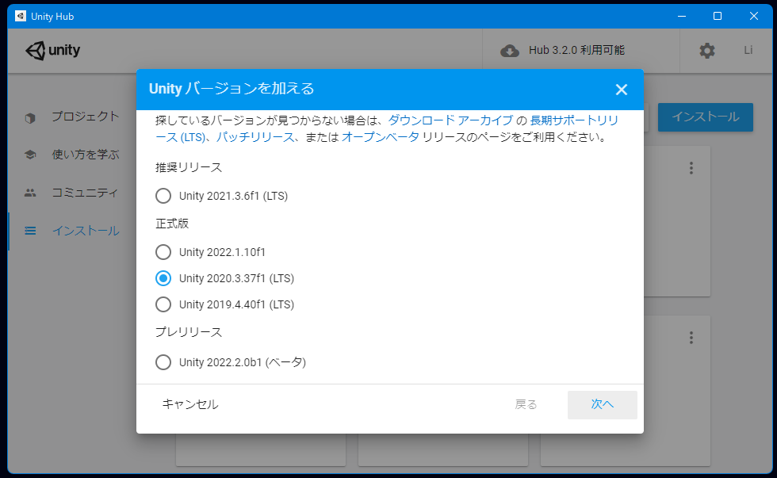
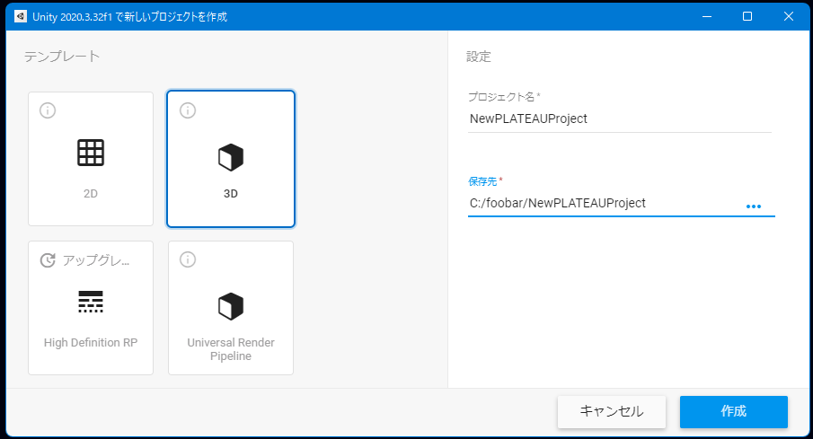
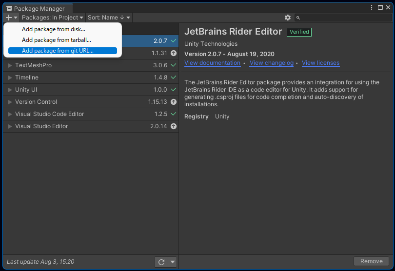

# インストール

このページでは PLATEAU SDK for Unity のインストール方法を説明します。

## 対応Unityバージョンのインストール
- PLATEAU SDK for Unity は、Unityバージョン ```2020.3``` を想定しています。  
  そのバージョンがインストールされていない場合は、次の手順でインストールしてください。
  - [Unity Hub をこちらからインストールします](https://unity3d.com/jp/get-unity/download)。
  - Unity Hubを起動し、左のサイドバーから```インストール``` → 右上のボタンから```インストール``` をクリックします。

  - Unity 2020.3 で始まるバージョンを選択し、```次へ```を押します。

  - ```実行``` してインストールします。

## Unityプロジェクトの作成
- Unity Hub の左サイドバーの```プロジェクト``` を押し、右上の```新規作成```ボタンの右隣にある矢印マークをクリックします。

- 先ほどインストールしたバージョンを選択して```次へ```を押します。
- プロジェクト名と保存先を入力し```作成```を押します。


## PLATEAU Unity SDK の導入
導入方法は ~~Github から導入するか、または~~ 配布の tgz ファイルから導入できます。  
（Coming soon: Githubリポジトリは現在のところ非公開です。配布の tgz から導入してください。今後オープンソースで公開される予定です。）  


### 配布の tgz ファイルから導入する場合
- Unityのメニューバーから ```Window``` → ```Package Manager``` を選択します。
- Package Manager ウィンドウの左上の＋ボタンから ```Add pacakge from tarball...``` を選択します。
  
- ウィンドウのパッケージ一覧に ```Plateau Unity SDK``` が表示されたら完了です。
  

### Githubから導入する場合

> [!NOTE]
> **Coming soon**  
> Githubリポジトリは現在のところ非公開です。今後オープンソースで公開される予定です。

 - Unityのメニューバーから ```Window``` → ```Package Manager``` を選択します。
 - Package Manager ウィンドウの左上の＋ボタンから ```Add package from git URL...``` を選択します。

 - 次のURLを入力して ```Add``` を押します。  
   （Coming soon: リポジトリは今後公開予定です）
 - ウィンドウのパッケージ一覧に ```Plateau Unity SDK``` が表示されたら完了です。
