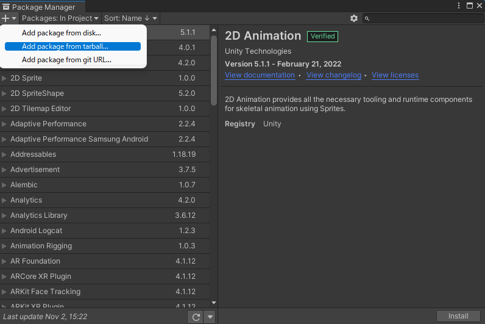
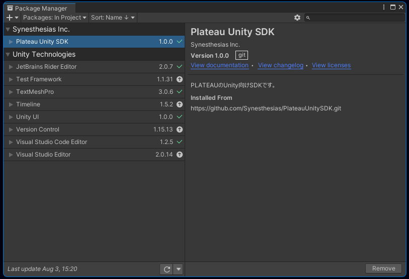

# インストール

このページでは PLATEAU SDK for Unity のインストール方法を説明します。

## 対応Unityバージョンのインストール
- PLATEAU SDK for Unity は、Unityバージョン `2021.3` を想定しています。  
  そのバージョンがインストールされていない場合は、次の手順でインストールしてください。
  - [Unity Hub をこちらからインストールします](https://unity3d.com/jp/get-unity/download)。
  - Unity Hub とは、Unityのお好きなバージョンをインストールして起動することのできるソフトウェアです。
  - Unity Hubを起動し、左のサイドバーから`インストール` → 右上のボタンから`エディターをインストール` をクリックします。

  - Unity 2021.3 で始まるバージョンを選択し、`インストール`を押します。

## Unityプロジェクトの作成
- Unity Hub の左サイドバーの`プロジェクト` を押し、右上の`新しいプロジェクト`ボタンをクリックします。

- 新しいプロジェクトの設定画面で、次のように設定します。
  - 画面上部の `エディターバージョン` を `2021.3` で始まる番号にします。
  - 画面中部の`テンプレート` は `3D` を選択します。
  - 画面右下のプロジェクト名をお好みのものに設定します。
  - `プロジェクトを作成`ボタンを押します。
  
  
## PLATEAU Unity SDK の導入
PLATEAU SDK for Unity の導入方法は2通りあります。

- 1つは、配布の tgz ファイルから導入する方法
- 2つ目に、gitのURL指定で導入する方法です。  

どちらか1つを行ってください。

### tgzファイルから導入する方法
- [PLATEAU SDK for Unity のリリースページ](https://github.com/Project-PLATEAU/PLATEAU-SDK-for-Unity/releases) から tgzファイルをダウンロードします。
- Unityのメニューバーから `Window` → `Package Manager` を選択します。
- Package Manager ウィンドウの左上の＋ボタンから `Add pacakge from tarball...` を選択します。
  
- ウィンドウのパッケージ一覧に `Plateau Unity SDK` が表示されたら完了です。
  

### gitのURL指定で導入する方法
- 導入したいバージョンを確認するため、 [PLATEAU SDK for Unity のリリースページ](https://github.com/Project-PLATEAU/PLATEAU-SDK-for-Unity/releases) にアクセスします。
- リリースのリンクをクリックし、導入したいバージョンのタグ（画像の箇所）をメモします。
  
- Unityのメニューバーから `Window` → `Package Manager` を選択します。
- Package Manager ウィンドウの左上の＋ボタンから `Add pacakge from git URL...` を選択します。
- 入力欄に次を入力します。
  - GithubリポジトリのURLに、`#(先ほどメモしたタグ名)` を付けたものを入力してください。例えば次のとおりです：
  - `https://github.com/Project-PLATEAU/PLATEAU-SDK-for-Unity.git#v1.0.0`
    
  - なお、`#(タグ名)`を省略するとデフォルトブランチになりますが、  
    デフォルトブランチは内容が予告なく変更されるので推奨しません。  
    タグ名を記載することを推奨します。
- `Add` ボタンを押します。
- ウィンドウのパッケージ一覧に `Plateau Unity SDK` が表示されたら完了です。
  