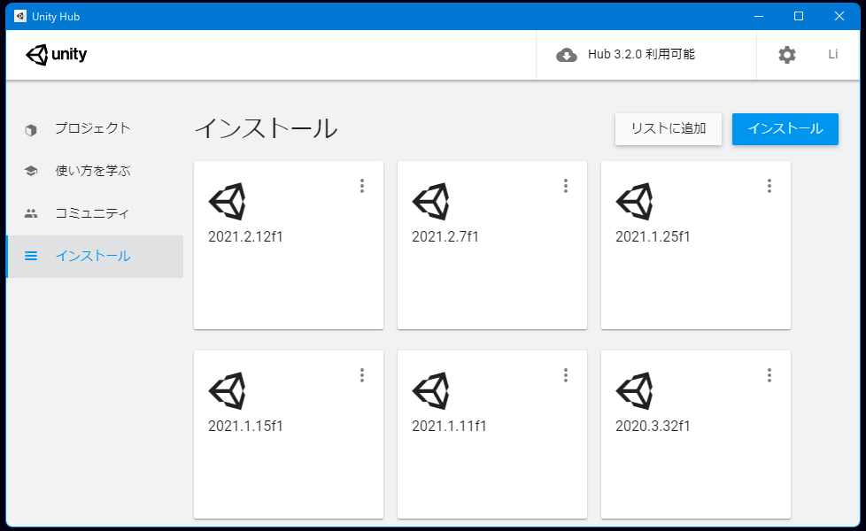

# インストール
## 対応Unityバージョンのインストール
- PLATEAU Unity SDK は、Unityバージョン ```2020.3``` を想定しています。  
  そのバージョンがインストールされていない場合は、次の手順でインストールしてください。
  - [Unity Hub をこちらからインストールします](https://unity3d.com/jp/get-unity/download)。
  - Unity Hubを起動し、左のサイドバーから```インストール``` → 右上のボタンから```インストール``` をクリックします。

  - Unity 2020.3 で始まるバージョンを選択し、```次へ```を押します。

  - ```実行``` してインストールします。

## Unityプロジェクトの作成
- Unity Hub の左サイドバーの```プロジェクト``` を押し、右上の```新規作成```ボタンの右隣にある矢印マークをクリックします。

- 先ほどインストールしたバージョンを選択して```次へ```を押します。
- プロジェクト名と保存先を入力し```作成```を押します。


## PLATEAU Unity SDK の導入
 - Unityのメニューバーから ```Window``` → ```Package Manager``` を選択します。
 - Package Manager ウィンドウの左上の＋ボタンから ```Add package from git URL...``` を選択します。

 - 次のURLを入力して ```Add``` を押します。  
   https://github.com/Synesthesias/PlateauUnitySDK.git
 - ウィンドウのパッケージ一覧に ```Plateau Unity SDK``` が表示されたら完了です。
