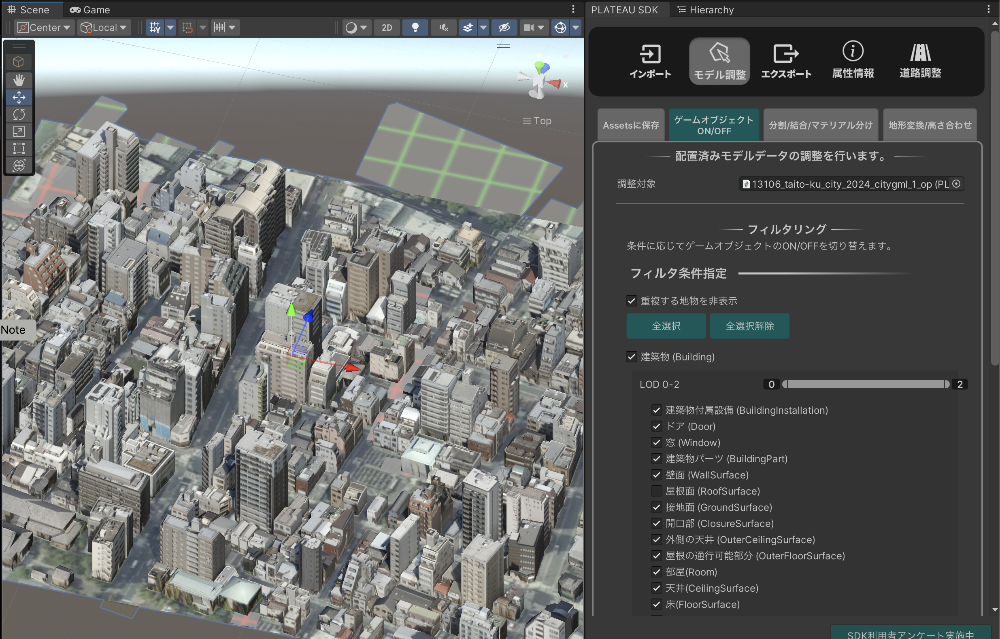
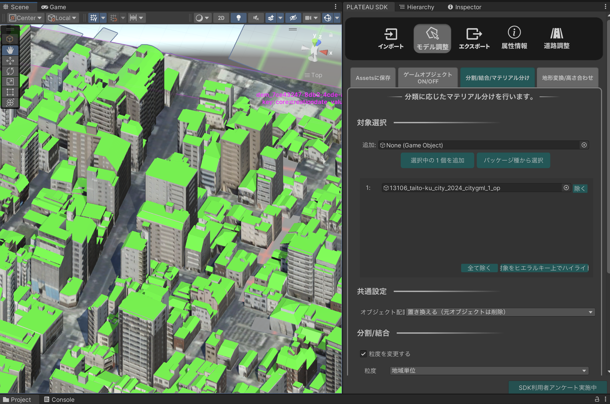
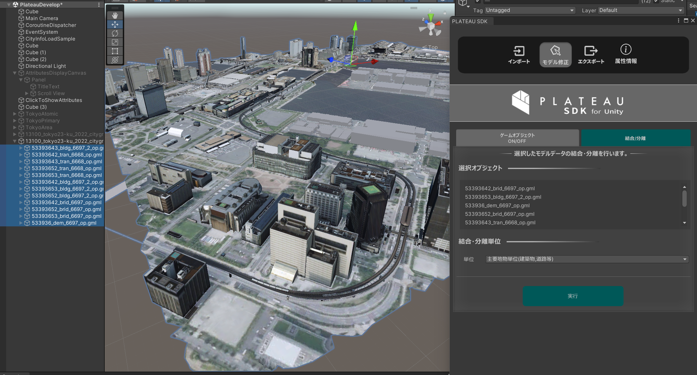

# モデル修正

## 概要

PLATEAUウィンドウの`モデル修正`では、インポートした都市モデルを編集できます。  
次の機能があります。
- ゲームオブジェクトON/OFF
  - 条件指定で一括でアクティブ化・非アクティブ化します。
- マテリアル分け
  - 地物型に応じてマテリアルを分けます。
- 結合・分離
  - モデルを結合・分離し、ゲームオブジェクトの粒度を変更します。

### 操作画面の開き方

- Unityのメニューバーから `PLATEAU` → `PLATEAU SDK` を選択します。
- ウィンドウ上部のタブのうち `モデル調整` を選択します。
- その下のタブで`ゲームオブジェクトON/OFF`、`結合/分離`を切り替えて表示します。
  

## ゲームオブジェクトON/OFF機能

- 条件指定をしてフィルタリングできます。
- ここでいうフィルタリングとは、条件に合致するゲームオブジェクトをアクティブにし、そうでないものを非アクティブにすることを指します。
- 「重複する地物を表示」にチェックを入れた場合、フィルタリング後に重複している地物について、  
  もっともLODが高いもののみを残してそれ以外を非表示にします。
- 表示したい地物の種類をチェックボックスで指定します。
- チェックボックスは入れ子構造になっています。
  - 第1階層のチェックボックスは、「建築物」「道路」などのパッケージ種別を指定します。
  - 複数のLODがシーン中に存在する場合、パッケージ種別ごとにLOD範囲選択のスライダーを使ってLODを指定できます。
  - 第2階層のチェックボックスは、「ドア」「屋根」など細かい都市オブジェクト分類での種別を指定します。

> [!NOTE]  
> 都市インポート時のメッシュ結合単位の設定によっては、第2階層の分類チェックマークが動作しない場合があります。  
> 例えば、インポート時に建物を「最小地物単位」に指定した場合、「窓」「屋根面」などでゲームオブジェクトが分かれているので、細かい分類のチェックマークが動作します。  
> しかし、建物を「主要地物単位」にした場合、建物ごとにゲームオブジェクトが結合されているので、細かい「窓」「屋根面」といった分類は動作しません。  
> 分類指定のチェックマークは入れ子構造になっていますが、第1階層の「建築物」「道路」といった分類は結合単位によらず必ず動作し、  
> 第2階層の「窓」「屋根面」といった細かい分類はインポート時に「最小値物単位」にした場合のみ動作します。

## マテリアル分け機能

### できること
- 地物型に応じてマテリアルを設定できます。
- 例えば上図は、建築物の屋根面を緑色のマテリアルに設定した例です。

### 操作方法
- `選択オブジェクト`には、現在選択中のゲームオブジェクトが表示されます。これが処理の対象になります。複数選択可能です。
  - 対象は、コンポーネント`PLATEAUCityObjectGroup`が付与されているゲームオブジェクト、またはその親である必要があります。
  - 対象に`PLATEAUCityObjectGroup`がない場合、インポート時に属性情報を含める設定にしたことを確認してください。
- `マテリアル分類`には`地物型`と表示され、地物型に応じてマテリアルを張り替えることを示しています。
  - 今は地物型しか選べませんが、今後は属性情報で分けるモードも追加予定です。
- `検索`ボタンを押すと、選択対象に含まれる地物型が検索され、ボタン下に列挙されます。
  - このあとで対象オブジェクトを変更したい場合は、`再選択`ボタンを押します。
- `粒度`では、処理後に3Dモデルがどの粒度でゲームオブジェクトに分けられるかを選択します。
- 処理前のゲームオブジェクトを削除するか、残すかを選択します。
- 地物型ごとにマテリアルを選択します。
  - 画面には、選択した地物に含まれる地物型が列挙されています。
  - それぞれの地物型について、マテリアルを変更するか、変更する場合はどのマテリアルにするかを指定します。
- 実行ボタンを押すと、処理を実行します。

## 結合/分離機能

### できること

- 選択されたゲームオブジェクトの粒度を変更します。
- 例えば、主要地物単位でインポートされたものを結合して地域単位にまとめたり、分解して最小地物単位にしたりできます。
- 属性情報も合わせて分割・結合されます。

### 操作方法

- `選択オブジェクト`には、現在選択中のゲームオブジェクトが表示されます。これが変換対象になります。
  - 選び方は、変換したいゲームオブジェクトの親を1つ選択しても良いですし、変換したい地物を複数選択しても良いです。
- `単位`では変換後の結合粒度を指定します。
  - `地域単位`： 3Dモデルが1つのゲームオブジェクトにまとまります。
  - `主要地物単位`： 例えば建築物の場合、建物1つごとに1つのゲームオブジェクトになります。
  - `最小地物単位`： 例えば建築物の場合、窓、屋根などのパーツごとに1つのゲームオブジェクトになります。
- `実行`ボタンで変換を実行します。
- 実行後、ダイアログが表示され、変換前のゲームオブジェクトを削除するか残すかを選択できます。