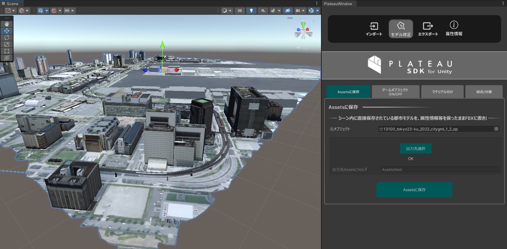
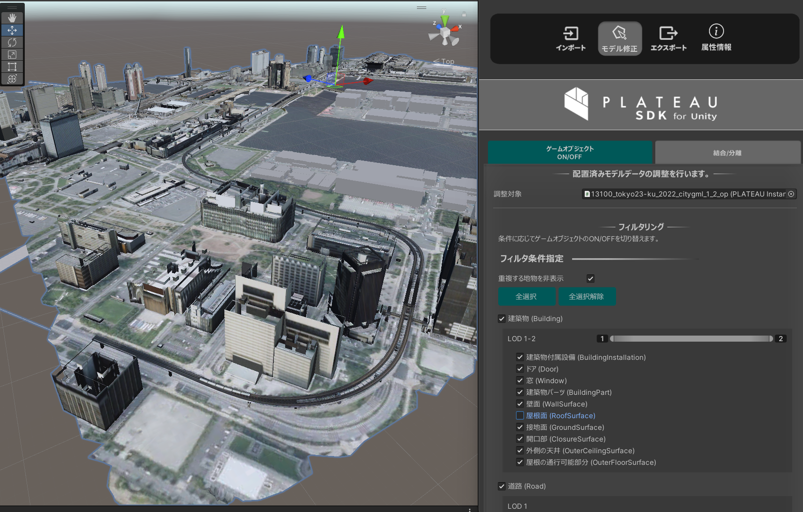
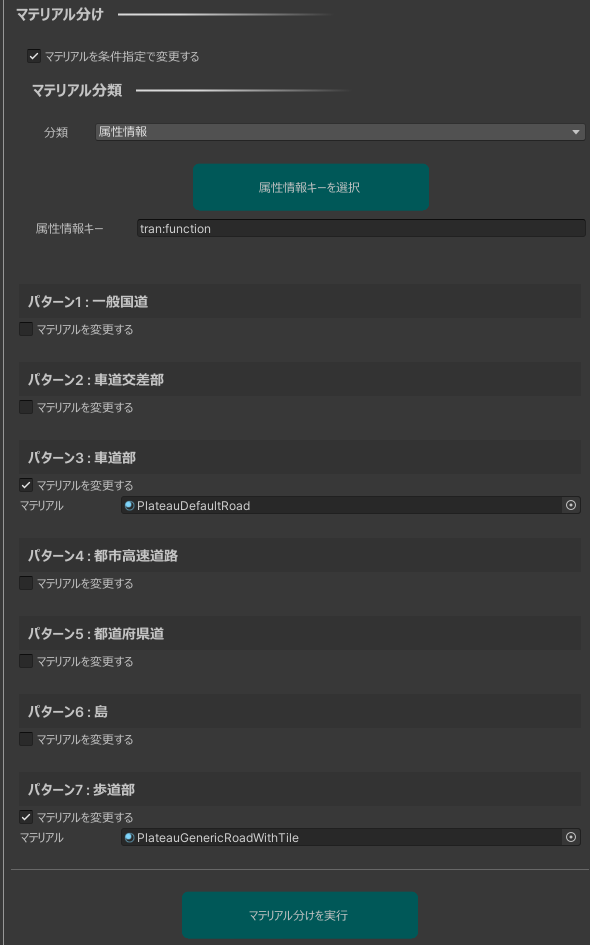
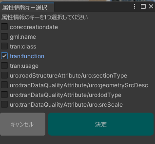
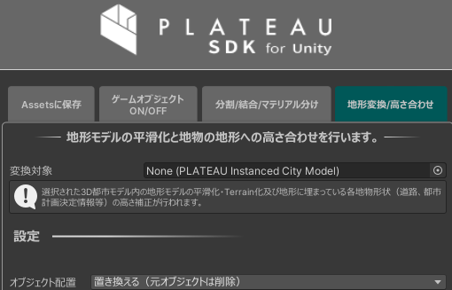
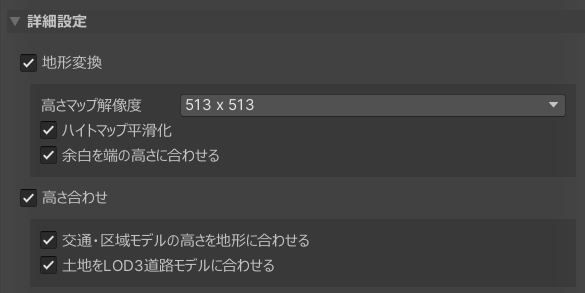

# 3D都市モデルの編集

## 概要

PLATEAUウィンドウの`モデル修正`では、インポートした都市モデルを編集できます。  
次の機能があります。
- Assetsに保存
  - シーン内に直接保存されている都市モデルを、属性情報等を保ったままFBXに書き出します。
  - 肥大化したシーンファイルを軽量化するのに便利です。
- ゲームオブジェクトON/OFF
  - 条件指定で一括でアクティブ化・非アクティブ化します。
- 分割/結合/マテリアル分け
  - 地物の結合・分離や属性情報・地物型によるマテリアル分けを行います。
- 地形変換/高さ合わせ
  - 地形の平滑化とテレインへの変換、高さ情報が無い地物（LOD1道路モデル等）の地形への高さ合わせを行います。

### 操作画面の開き方

- Unityのメニューバーから `PLATEAU` → `PLATEAU SDK` を選択します。
- ウィンドウ上部のタブのうち `モデル調整` を選択します。
- その下のタブで各機能を切り替えて表示します。
  

## 「Assetsに保存」機能

### できること

- シーン内に直接保存されている都市モデルを、  
  属性情報等を保ったままFBXに書き出すことでシーンファイルを軽量化します。
- PLATEAU SDKを使ってインポートした3Dモデルやテクスチャは、  
  通常シーンファイルに直接保存されます。   
  このデメリットとして、シーンファイルが肥大化し、保存等の操作に時間がかかることがあります。  
  そのような状況を改善するため、シーン内に埋め込まれた都市モデルを  
  FBX形式でAssetsフォルダ内に書き出し、シーンの容量を削減して編集しやすくするための機能です。  
  加えて、UnityのFBXインポート設定が可能になることで調整の幅が広がる利点もあります。
- Assetsに保存しても、属性情報やマテリアルは維持されます。  
  また、別途アドオンであるPLATEAU-SDK-Toolkits-for-Unityの自動テクスチャ機能を適用している場合も、その見た目が維持されます。

### 使い方

- `元オブジェクト` には、処理の対象にしたいゲームオブジェクトを選択します。
  - そのヒエラルキーの子も対象となります。
- `出力先選択`ボタンを押して、出力先を選択します。出力先は次の条件を満たす必要があります。
  - UnityプロジェクトのAssetsフォルダ以下であること
  - 空のフォルダであること
- `Assetsに保存`ボタンを押して実行します。
- 実行すると、新しいゲームオブジェクト`Asset_(元のゲームオブジェクト名)`が生成されます。
  - 生成された3Dモデルは、見た目は元と同じですが、  
    3Dモデルとテクスチャの実態は、出力先に生成されたFBXやテクスチャを参照しています。
  - マテリアルと都市の情報（属性情報など）は元オブジェクトからコピーされます。
- 生成結果に問題がなければ、元のゲームオブジェクトを削除して  
  シーンを保存することでシーンファイルが軽量化されます。

## ゲームオブジェクトON/OFF機能

- 条件指定をしてフィルタリングできます。
- ここでいうフィルタリングとは、条件に合致するゲームオブジェクトをアクティブにし、そうでないものを非アクティブにすることを指します。
- 「重複する地物を表示」にチェックを入れた場合、フィルタリング後に重複している地物について、  
  もっともLODが高いもののみを残してそれ以外を非表示にします。
- 表示したい地物の種類をチェックボックスで指定します。
- チェックボックスは入れ子構造になっています。
  - 第1階層のチェックボックスは、「建築物」「道路」などのパッケージ種別を指定します。
  - 複数のLODがシーン中に存在する場合、パッケージ種別ごとにLOD範囲選択のスライダーを使ってLODを指定できます。
  - 第2階層のチェックボックスは、「ドア」「屋根」など細かい都市オブジェクト分類での種別を指定します。

> [!NOTE]  
> 都市インポート時のメッシュ結合単位の設定によっては、第2階層の分類チェックマークが動作しない場合があります。  
> 例えば、インポート時に建物を「最小地物単位」に指定した場合、「窓」「屋根面」などでゲームオブジェクトが分かれているので、細かい分類のチェックマークが動作します。  
> しかし、建物を「主要地物単位」にした場合、建物ごとにゲームオブジェクトが結合されているので、細かい「窓」「屋根面」といった分類は動作しません。  
> 分類指定のチェックマークは入れ子構造になっていますが、第1階層の「建築物」「道路」といった分類は結合単位によらず必ず動作し、  
> 第2階層の「窓」「屋根面」といった細かい分類はインポート時に「最小値物単位」にした場合のみ動作します。

## 分割・結合・マテリアル分け機能

### できること

- 選択されたゲームオブジェクトの粒度を変更できます。
  - 例えば、主要地物単位でインポートされたものを結合して地域単位にまとめたり、分解して最小地物単位にしたりできます。
  - 属性情報も合わせて分割・結合されます。
- 地物型や属性情報に応じてマテリアルを設定できます。
  - 例えば上図は、地物型によるマテリアル分けによって建築物の屋根面を緑色のマテリアルに設定した例です。
  - また下図は、属性情報によるマテリアル分けによって道路のうち歩道を茶色、車道を灰色に設定した例です。

### 操作方法
- PLATEAU Windowの「モデル修正」タブ → 「分割/結合/マテリアル分け」タブを開きます。
  
  

#### 対象選択

`対象選択`では処理の対象となるゲームオブジェクトを指定します。  
指定の方法は次のとおりいくつかあります。
- `追加`スロットにゲームオブジェクトをドラッグするか選択することで追加します。
- `選択中のn個を追加`ボタンを押すことで、現在選択中のオブジェクト（複数可）を追加します。
- `パッケージ種から選択`ボタンを押すことで下図の選択ウィンドウが開き、指定のパッケージ種に該当するものをまとめて指定します。  

  - パッケージ種選択ウィンドウ内でデータセットを選択すると、データセットに含まれるパッケージ種が検索され選択肢として表示されます。
  - 選択肢から任意個のパッケージを選んで`決定`を押して選択できます。
- 追加したオブジェクトは`除く`ボタンで対象から除きます。

#### 共通設定

- `オブジェクト配置`では、変換後に元オブジェクトを削除するか残すかを選択します。
- 
#### 分割/結合

- `粒度を変更する`にチェックが入っている場合、`粒度`で指定した粒度に変換します。
  - 最小地物単位（壁面・屋根等面等ごと）
  - 主要地物内のマテリアルごと（マテリアル分けの結果に応じてゲームオブジェクトを分けた場合に便利です）
  - 主要地物単位（建築物・道路等ごと）
  - すべて1つに結合（インポート時の地域単位に相当します）
- `粒度を変更する`にチェックが入っていない状態でマテリアル分けした場合、現在と同じ粒度にします。
- 後述の`マテリアル分けを条件指定で変更する`にチェックが入っていない状態で実行ボタンを押した場合、  
  マテリアルを変えずに粒度を変更します。

#### マテリアル分け

条件に応じてマテリアル分けをします。  
また分割/結合で粒度が指定されている場合、その粒度に変換します。
- `マテリアルを条件指定で変更する` にチェックが入っている場合、以下の設定項目のとおりにマテリアルを分けます。  
  チェックが入っていない場合、マテリアルを変更せず分割結合のみ行います。
- `分類`は、マテリアル分けの基準として`地物型`か`属性情報`を選択できます。

#### 地物型でのマテリアル分け

- `地物型`をマテリアル分けの基準とした場合、設定項目は次のようになります。  
  下図は建築物のうち屋根面のみを緑色にする場合の設定です。

- `検索`ボタンを押すことでマテリアルの設定画面が表示されます。
- `パターン`で表示される条件に合致するマテリアルを指定します。
- `マテリアルを変更する`にチェックが入っていないものはマテリアルを変更しません。  
  チェックが入っているものに関してマテリアルを選択します。

##### 属性情報でのマテリアル分け

- `属性情報`をマテリアル分けの基準とした場合、設定項目は次のようになります。  
  下図は道路のうち歩道部分を茶色、車道部分をグレー色にする場合の設定です。

- `属性情報キー`で分類基準となる属性情報のキーを指定します。
  - この際、`属性情報キーを選択`ボタンを押すことで下図のウィンドウが表示され、選択肢から選んで入力できます。  
        
    このウィンドウでは、対象オブジェクトとその子に存在する属性情報を検索して表示します。  
    選択肢から1つ選んで`決定`ボタンを押すことで属性情報キーを選択します。
- 以下、`検索`ボタン、パターンごとのマテリアル指定、実行は上述の「地物型でのマテリアル分け」と同じです。

## 地形変換/高さ合わせ機能

`地形変換/高さ合わせ`画面では以下を行えます。
- 地形の平滑化
  - 地形モデルの平滑化・テレインへの変換を行います。
- 高さ合わせ
  - LOD1道路等、高さが付与されていない地物の地形への高さ合わせや、LOD3道路にめり込んでしまっている地形の形状修正を行います。

> [!NOTE]  
> 高さ合わせ対象となる都市モデルは次のパッケージタイプです。
> 「道路、災害リスク、土地利用、都市計画決定情報、徒歩道、広場、水部、交通(航路)」

### 使い方

- `変換対象`には、起伏モデルを含む都市モデルを選択します。
- `オブジェクト配置`プルダウンを選択します。
  - `新規追加`は元のコンポーネントを非表示にし、そのまま残します。
  - `置き換える`は元のコンポーネントを削除します。
- `詳細設定`から更に細かい設定が行えます。
- `実行`ボタンを押すと地形の平滑化が行われ、道路、災害リスク、土地利用等対象の都市モデルが変換した地形に重なるよう自動的に調整されます。

### 詳細設定

#### 地形変換
- `地形変換`にチェックを入れると地形の変換(平滑化・テレインへの変換)が有効になり、更に詳細なオプションが表示されます。
  - `解像度`プルダウンから変換時にハイトマップとして利用する画像解像度を選択できます。
  - `ハイトマップ平滑化`にチェックを入れるとハイトマップにぼかしフィルタを適用し、よりスムーズな地形になります。
  - `ハイトマップを生成する段階で、元の頂点座標とやや位置がずれます。
  - `余白を端の高さに合わせる`にチェックを入れるとハイトマップの余白を一番端のピクセルで埋めます。チェックが外れていると余白部分の高さは０になります。

#### 高さ合わせ機能
- `高さ合わせ`にチェックを入れると地物の高さ合わせが有効のなり、更に詳細なオプションが表示されます。
  - `交通・区域モデルの高さを地形に合わせる`にチェックをいれると道路、災害リスク、土地利用等の都市モデルを変換した地形に重なるよう調整します。
  - `土地をLOD3道路モデルに合わせる`にチェックをいれると地形モデルの形状がLOD3道路モデルに合わせて修正されます。

> [!CAUTION]
> 地形変換の機能を利用するためには、都市モデルインポート時に`起伏`を含めてインポートする必要があります。
