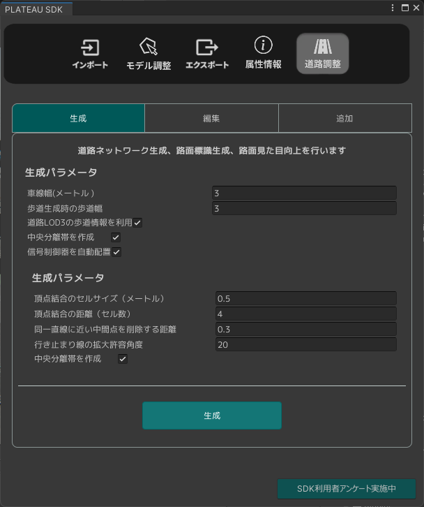
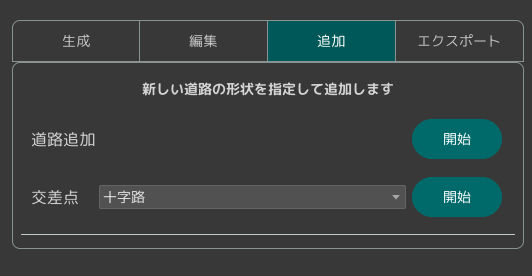

# 道路ネットワークの利用

PLATEAU SDKの機能によってインポートされた3D都市モデルから道路ネットワークの自動生成や編集ができます。 
このページでその方法を説明します。

## 道路ネットワークの機能を確認する(PLATEAU SDKのエディタ機能)
PLATEAU SDKウィンドウの「道路調整」タブを開くと、道路ネットワークに対して利用できる機能が表示されます。  

- 生成タブでは、道路ネットーワークの自動生成ができます。
- 編集タブでは、生成済みの道路ネットワークの編集ができます。
- 追加タブでは、生成済みの道路ネットワークに新しい道路や交差点を追加できます。

### 道路ネットワークの生成
PLATEAU SDKの機能によって`インポートされた3D都市モデル`から`道路ネットワークを自動で生成`します。  
パラメータの設定が完了したら生成ボタンをクリックしてしばらくすると道路ネットワークが生成されます。  
道路ネットワークは新しく生成されたゲームオブジェクトのコンポーネントに所持しています。  
`PLATEAURnStructureModel`コンポーネント

- 生成パラメータ  
  - 車線幅（メートル）：3D都市モデルの道路幅とこれを基準に車線が生成されます。車線数や形状に影響します。  
  - 歩道生成時の歩道幅：歩道が生成可能な場合にこれを基準に歩道が生成されます。  
  - 道路LOD3の歩道情報を利用：LOD3の歩道情報を利用して歩道を生成します。LOD3が無い場合は元の自動生成ロジックを利用します。  
  - 中央分離帯を作成：可能であれば中央分離帯を作成します。  
  - 信号制御器を自動配置：信号制御器、信号機を自動で生成します。信号の制御はデフォルト値が適用されています。  

- 詳細設定  
  - 頂点結合のセルサイズ（メートル）：道路の頂点を結合する際の参照範囲に関係する値です。  
  - 結合頂点の距離（セル数）：参照範囲内の頂点を結合するかを判断する閾値です。  
  - 同一直線に近い中間点を削除する距離：3つの頂点が同一直線上に並んでいるかを判断する閾値です。同一直線上にある際には中央の頂点は削除されます。  
  - 行き止まりの線の拡大許容角度：行き止まり検出判定時に同一直線と判断する角度の総和です。  
  - 高速道路を対象外にする：高速道路を自動生成の対象外にします。  

### 道路ネットワークの編集
生成済みの道路ネットワークを編集することが出来ます。ここでは既にある道路と交差点を編集します。  

### 道路ネットワークへ交差点や道路の追加
開発中の機能です。  

  