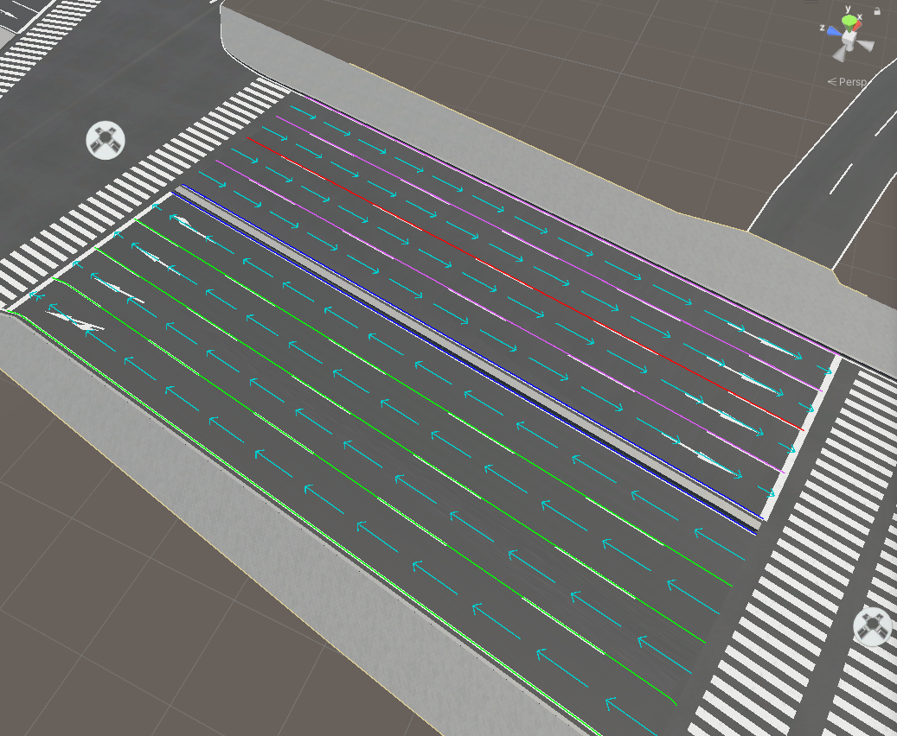
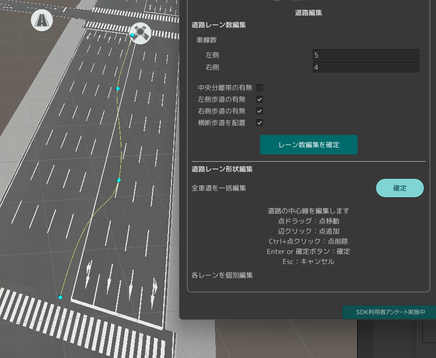

# 道路ネットワークの利用

インポートされた道路モデルから  
道路ネットワークの自動生成や編集、および道路の見た目を向上できます。
このページでその機能を説明します。

## 道路ネットワーク機能の概要
道路ネットワークとは、道路の車道、歩道、交差点などのレーンと、それらのつながりを構造化したものです。

本機能では、道路メッシュの形状から道路の構造を推定し、ユーザーが入力したパラメーターに応じて、見た目の向上、道路ネットワークの生成を行います。  
具体的には次の機能があります。
- 推定された車道形状を基に、道路に白線や停止線を引きます。
- 推定された歩道と車道に対して、それぞれ別のマテリアルを設定します。
- 歩道と中央分離帯（3D都市モデルにおける島）を段差にして盛り上げます。
- 推定された車道に対応する道路ネットワークを生成・出力します。

加えて、別途プラグインであるPLATEAU SDK Toolkits for Unityを導入することで、  
道路ネットワークをもとに車両の交通シミュレーションが可能になります。  
  
自動生成される道路ネットワークは推定であり、現実の道路とは異なる場合があります。  
現実と合わせたい場合は、道路ネットワークの手動編集を利用してください。

## 道路ネットワークの機能について
下図が道路ネットワーク機能に関する画面です。  
この画面を開くには、メニューバーの PLATEAU → PLATEAU SDKからウィンドウを開き、「道路調整」タブを開きます。  

道路調整の画面は以下のタブに分かれています。

- `生成`：道路ネットワークの自動生成ができます。
- `編集`：生成済みの道路ネットワークの編集ができます。
- `追加`：生成済みの道路ネットワークに新しい道路や交差点を追加できます。
- `エクスポート`： 道路ネットワークをGeoJson形式でエクスポートできます。

### 「生成」タブ
生成タブの画面では、インポート済みの道路モデルから道路ネットワークを自動で生成できます。  
「生成」ボタンをクリックしてしばらくすると道路ネットワークが生成されます。  
加えて、車道の白線や停止線、横断歩道、車線の矢印標示が生成され、歩道の車道の間は段差になり、見た目が良くなります。 

ここでシーンに生成されるオブジェクトは次の通りです。
- `ReproducedRoad`という名称のゲームオブジェクト
  - 生成された道路メッシュおよび道路標示（白線、停止線など）がこの子オブジェクトに格納されます。
  - 各子オブジェクトにはコンポーネント `PLATEAUReproducedRoad` が付与されており、どの道路モデルから生成されたかが記録されます。
  - 子ゲームオブジェクトの名称は、道路メッシュであれば `Road-(道路オブジェクト名)` となり、横断歩道であれば`Crosswalk-(道路オブジェクト名)` 、白線および車線の矢印であれば `LaneArrow-(道路オブジェクト名)` となります。
- `RoadNetwork`という名称のゲームオブジェクト
  - これに付与されているコンポーネント `PLATEAURnStructureModel` に道路ネットワークが格納されます。
  - 同ゲームオブジェクトに付与されているコンポーネント `PLATEAURnModelDrawerDebug`では、`Visible`をオンにすることで道路ネットワーク構造を可視化できます。
  - 可視化する種類、色などを同コンポーネントで設定できます。可視化時はPCの動作が重くなることがあります。
  - 下図はメインの`Visible`をオンにしたうえで、`Intersection Op`(交差点)の`Visible`、`Road Op`の`Visible`、`Way Op`の`Visible`、および`Lane Op`の`Visible`をオンにした場合の表示です。

道路ネットワーク生成時、すでに上記の生成ゲームオブジェクトが存在する場合は、古いものを置き換える形で生成します。  
  
生成された道路は元の道路と重なって表示されるため、綺麗に表示するためには元の道路を非表示にすることを推奨します。    
ただし、再度道路ネットワークを生成する際は元の道路を表示する必要があるため表示後に実行してください。
 

道路ネットワーク生成の設定項目は次のとおりです。

- 生成パラメータ  
  - `車線幅（メートル）`：3D都市モデルの道路幅と車線幅を基準に車線が生成されます。車線数や形状に影響します。  
  - `歩道生成時の歩道幅`：歩道が生成可能な場合にこの幅を基準に歩道が生成されます。
  - `横断歩道の配置`：横断歩道を配置する条件を次から選びます。
    - `大きい道路に配置` : 道路の車線数が2以上、かつ長さが30m以上の道路に横断歩道を配置します。
    - `すべての交差点に配置` : すべての交差点に横断歩道を配置します。
    - `配置しない` : 横断歩道を配置しません。
  - `道路LOD2以上の歩道情報を利用`：LOD2以上の道路に歩道情報があれば、それを利用して歩道を生成します。LOD1しか無い場合は、チェックを外した場合と同様に推定により歩道を決めます。  
  - `中央分離帯があれば生成`：道路の属性情報として中央分離帯があり、それが1つのレーンを形成している場合に中央分離帯を作成します。  
  - `信号制御器を自動配置`：信号制御器、信号機を自動で生成します。信号の制御（信号現示の時間）にはデフォルト値が適用されています。  

- 詳細設定   
  - `同一直線に近い中間点を削除する距離`：3つの頂点が同一直線上に並んでいるかを判断する閾値です。同一直線上にある際には中央の頂点は削除されます。  
  - `行き止まりの線の拡大許容角度`：行き止まりの末端線の検出において、道路の末端の線の曲がり角の総和がどの角度以内なら同一直線の行き止まりとみなすかです。行き止まり道路の末端と判別される線が実際より長くて側面まで延びている場合は小さい値に、末端の線が実際より短い場合は大きい値にすると良いです。  
  - `高速道路を対象外にする`：高速道路を自動生成の対象外にします。高速道路は、複雑な立体交差などの判別がうまくいかないことが多いためデフォルトで対象外となっています。  

### 歩道推定の仕組み
LOD1の道路の歩道を推定する仕組みを説明します。  
まずすべてを車道扱いで生成します。    
次に、パラメータで指定した歩道幅より太い道路の場合、車道を狭めて歩道を追加します。  
ただし、これにより車道幅が2m未満になる場合は歩道を生成しません。

### 「編集」タブ
編集タブの画面では、生成済みの道路ネットワークを編集します。ここでは道路と交差点を編集します。  

「編集モード」ボタンをクリックしてを有効化すると、シーンビュー上に道路と交差点の2種類のアイコンが表示されます。 
アイコンをクリックして編集対象を選択します。

#### 道路編集

編集対象に道路を選んだとき、次の操作ができます。

- 【幅変更】シーンビュー上で車線や歩道の境界をドラッグして幅を変更します。 
- 【道路レーン数編集】PLATEAU SDKウィンドウから車線数や歩道・中央分離帯の有無、および横断歩道の有無を設定します。
- 【道路レーン形状編集】車線のカーブ具合を変更します。

##### 幅変更
シーンビュー上では、白線が引かれている箇所（歩道の境界、車線の境界）を左右にドラッグすることで  
歩道や車道の幅を変更できます。

#### 道路レーン数編集
PLATEAU SDKウィンドウ上で、車線数や歩道・中央分離帯の有無、および横断歩道の有無を設定できます。
ウィンドウ上での設定は「レーン数編集を確定」ボタンをクリックすることで反映されます。  
 

- `車線数`：道路の車線数を変更します。
- `中央分離帯の有無`：中央分離帯の有無を変更します。
- `歩道の有無`：歩道の有無を変更します。
- `横断歩道の配置`：横断歩道の有無を変更します。

#### 道路レーン形状編集
車線のカーブ具合を変更します。次の編集モードがあります。  
- `全車道を一括編集`: 車道の形を全体的に編集します。
- `各レーンを個別編集`: 歩道と車道の各レーンについて、線を1つずつ編集します。

##### 全車道を一括編集
使い方：
- 編集モードで道路が選択されているとき、「全車道を一括編集」の開始ボタンを押します。  
- 道路の中心に、青い球体で挟まれた線が出現します。これが編集中の線（スプライン）です。

- スプラインの線上をクリックすることで点（球体）を追加し、点をドラッグして線を変形できます。
- Ctrlキーを押しながら点をクリックすることで点を削除できます。
- 確定ボタンを押した時、またはEnterキーを押した時、スプラインに沿って道路が変形します。
- Escキーで確定前の編集内容をキャンセルします。

#### 各レーンを個別編集

使い方：
- 編集モードで道路が選択されているとき、「各レーンを個別編集」の開始ボタンを押します。
- まず線をクリックして選択します。すると頂点の位置が球体として可視化されます。
- 球体をドラッグして点を移動、Ctrl+球体クリックで点を削除、辺をクリックして点を追加します。
- Enterキーで確定、Escキーで確定前の編集内容をキャンセルします。
- SDKウィンドウの終了ボタンを押すことで個別編集を終了します。

#### 交差点編集

編集対象に交差点を選んだとき、トラック（交差点内の車の経路）の有無と形状を編集できます。

#### トラック（交差点内経路）の追加削除
トラックの有無を切り替えることで、隣接道路の車線の矢印標示を変更できるほか、Sandbox Toolkits for Unityの交通シミュレーションにおける車の進行方向にも反映されます。
- 経路を選択するために、まず赤い丸（トラックの流入点）をクリックし、その次に青い丸（流出点）をクリックします。
- 選択した流入点・流出点をもつトラックがなければ新規作成され、あれば削除されます。

#### 交差点の線の編集
交差点の外形を変更することで見た目を変更できるほか、トラック（交差点内経路）の形状を変更できます。これはSandbox Toolkits for Unityでの交通シミュレーションにも影響します。
- 交差点の外形である水色の線、またはトラックの経路である黄色の線をクリックして選択します。
- 線を選択すると、線の形状を編集できます。線上の点が球体として可視化されるので、球体をドラッグして移動、辺をクリックして点を追加、Ctrl+球体クリックで点を削除します。
- Enterキーで編集を確定します。

### 「追加」タブ
追加タブの画面では、道路ネットワークに対して交差点や道路を追加できます。

#### 道路追加

既存の道路ネットワークの端点に繋げる形で、新しい道路を追加できます。  
  
使い方:
- 道路追加の「開始」ボタンを押して道路追加モードに入ります。
- 接続可能な端点が黄色い丸で表示されます。丸をクリックして選択します。

- 新たに作成する道路の経路を指定します。
  - クリックで経路を追加します。
  - Enterキーで確定します。
  - Escキーで確定前の編集内容をキャンセルします。
  - 2つ以上の経路点を指定してカーブ形状を作ることもできます。ただし、複雑な形状では形が崩れる場合があります。

- 道路が生成されます。

- 「終了」ボタンを押して道路追加モードを終了します。

#### 交差点追加

既存の道路ネットワークの端点に繋げる形で、新しい交差点を追加できます。  
  
使い方：
- 交差点の選択肢で「十字路」または「T字路」を選択し、「開始」ボタンを押して交差点追加モードに入ります。
- 接続可能な端点が黄色い丸で表示されるため、丸をクリックして選択します。
- 生成される交差点の形状が緑色の線で表示されます。

- Rキーで緑色の線を回転させ、良ければEnterキーで確定します。やり直す場合はEscキーでキャンセルします。
- 交差点が生成されます。
- 「終了」ボタンを押して交差点追加モードを終了します。

### 「エクスポート」タブ
- 道路ネットワークをGeoJSON形式でエクスポートできます。GeoJSON形式は地理情報システムでよく利用される形式で、交通シミュレーションにも使われます。
- エクスポートされるデータの仕様に関しては、こちらのページ（※リンクを追加してください）をご参照ください。

※以下は重複しているため削除お願いします。
### 「エクスポート」タブ
- 道路ネットワークをGeoJSON形式でエクスポートできます。これは地理情報システムでよく利用される形式です。

