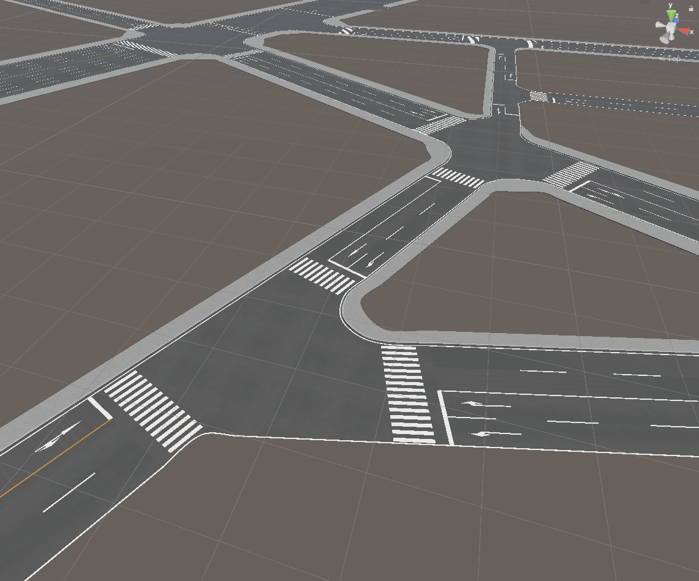

# 道路ネットワークの利用

インポートされた道路モデルから  
道路ネットワークの自動生成や編集、および道路の見た目を向上できます。   
このページでその機能を説明します。

## 道路ネットワーク機能の概要
道路ネットワークとは、道路の車道、歩道、交差点などのレーンとつながりを構造化したものです。

本機能では、道路メッシュの形状から道路の構造を推定し、見た目を向上します。  
具体的には次の機能があります。
- 推定された車道から道路に白線や停止線を引きます。
- 推定された歩道と車道から、歩道と車道のマテリアルを分けます。
- 歩道と中央分離帯を段差にして盛り上げます。

加えて、別途プラグインであるPLATEAU SDK Toolkits for Unityを導入することで、  
道路ネットワークをもとに車両の交通シミュレーションが可能になります。  
  
自動生成される道路ネットワークは推定であり、現実の道路とは異なる場合があります。  
現実と合わせたい場合は、道路ネットワークの手動編集を利用できます。

## 道路ネットワークの機能について
下図が道路ネットワーク機能に関する画面です。  
この画面を開くには、メニューバーの PLATEAU → PLATEAU SDKからウィンドウを開き、「道路調整」タブを開きます。  

道路調整の画面は次の4つのタブに分かれています。
- `生成`：道路ネットワークの自動生成ができます。
- `編集`：生成済みの道路ネットワークの編集ができます。
- `追加`：生成済みの道路ネットワークに新しい道路や交差点を追加できます。
- `エクスポート`： 道路ネットワークをGeoJson形式でエクスポートできます。

### 「生成」タブ
生成タブの画面では、インポート済みの道路モデルから道路ネットワークを自動で生成できます。  
「生成」ボタンをクリックしてしばらくすると道路ネットワークが生成されます。  
加えて、車道の白線や停止線、横断歩道、車線の矢印標示が生成され、歩道は段差になり、見た目が良くなります。 

ここでシーンに生成されるオブジェクトは次の通りです。
- `ReproducedRoad`という名称のゲームオブジェクト
  - 生成された道路メッシュおよび道路標示（白線、停止線など）がこの子オブジェクトに格納されます。
  - 各子オブジェクトにはコンポーネント `PLATEAUReproducedRoad` が付与されており、どの道路モデルから生成されたかが記録されます。
  - 子ゲームオブジェクトの名称は、道路メッシュであれば `Road-(道路オブジェクト名)` となり、横断歩道であれあば`Crosswalk-(道路オブジェクト名)` 、白線および車線の矢印であれば `LaneArrow-(道路オブジェクト名)` となります。
- `RoadNetworkTester`という名称のゲームオブジェクト
  - これに付与されているコンポーネント `PLATEAURnStructureModel` に道路ネットワークが格納されます。
  - 同ゲームオブジェクトに付与されているコンポーネント `PLATEAURnModelDrawerDebug`では、`Visible`をオンにすることで道路ネットワーク構造を可視化できます。
  - 可視化する種類、色などを同コンポーネントで設定できます。可視化時はPCの動作が重くなることがあります。
  - 下図はメインの`Visible`をオンにしたうえで、`Intersection Op`(交差点)の`Visible`、`Road Op`の`Visible`、`Way Op`の`Visible`、および`Lane Op`の`Visible`をオンにした場合の表示です。

道路ネットワーク生成時、すでに上記の生成ゲームオブジェクトが存在する場合は、古いものを置き換える形で生成します。  
  
生成された道路は元の道路と重なって表示されるため、綺麗に表示するためには元の道路を非表示にすることを推奨します。    
ただし、再度道路ネットワークを生成する際は元の道路を表示する必要があるため表示後に実行してください。
 

道路ネットワーク生成の設定項目は次のとおりです。

- 生成パラメータ  
  - `車線幅（メートル）`：3D都市モデルの道路幅と車線幅を基準に車線が生成されます。車線数や形状に影響します。  
  - `歩道生成時の歩道幅`：歩道が生成可能な場合にこの幅を基準に歩道が生成されます。
  - `横断歩道の配置`：横断歩道を配置する条件を次から選びます。
    - `大きい道路に配置` : 道路の車線数が2以上、かつ長さが30m以上の道路に横断歩道を配置します。
    - `すべての交差点に配置` : すべての交差点に横断歩道を配置します。
    - `配置しない` : 横断歩道を配置しません。
  - `道路LOD3の歩道情報を利用`：LOD3の道路に歩道情報があれば、それを利用して歩道を生成します。LOD3が無い場合は、チェックを外した場合と同様に推定により歩道を決めます。  
  - `中央分離帯があれば生成`：道路の属性情報として中央分離帯があり、それが1つのレーンを形成している場合に中央分離帯を作成します。  
  - `信号制御器を自動配置`：信号制御器、信号機を自動で生成します。信号の制御はデフォルト値が適用されています。  

- 詳細設定  
  - `頂点結合のセルサイズ（メートル）`：道路の頂点を結合するかどうかの判断に利用する最小単位のサイズです。  
  - `結合頂点の距離（セル数）`：頂点を結合するかを判断する閾値です。  
  - `同一直線に近い中間点を削除する距離`：3つの頂点が同一直線上に並んでいるかを判断する閾値です。同一直線上にある際には中央の頂点は削除されます。  
  - `行き止まりの線の拡大許容角度`：行き止まりの末端線の検出において、道路の末端の線の曲がり角の総和がどの角度以内なら同一直線の行き止まりとみなすかです。行き止まり道路の末端と判別される線が実際より長くて側面まで延びている場合は小さい値に、末端の線が実際より小さい場合は大きい値にすると良いです。  
  - `高速道路を対象外にする`：高速道路を自動生成の対象外にします。高速道路は、複雑な立体交差などの判別がうまくいかないことが多いためデフォルトで対象外となっています。  

### 「編集」タブ
編集タブの画面では、生成済みの道路ネットワークを編集します。ここでは道路と交差点を編集します。

「編集モード」ボタンをクリックしてを有効化すると、シーンビュー上に道路と交差点の2種類のアイコンが表示されます。  
アイコンをクリックして編集対象を選択します。

#### 道路編集

編集対象に道路を選んだとき、次の操作ができます。

- 【幅変更】シーンビュー上で車線や歩道の境界をドラッグして幅を変更します。 
- 【道路情報変更】PLATEAU SDKウィンドウから車線数や歩道、中央分離帯の有無、および横断歩道の有無を設定します。
- 【スプライン変更】車線のカーブ具合を変更します。

##### 幅変更
シーンビュー上では、白線が引かれている箇所（歩道の境界、車線の境界）を左右にドラッグすることで  
歩道や車道の幅を変更できます。

#### 道路情報変更
PLATEAU SDKウィンドウ上で、車線数や歩道、中央分離帯の有無、および横断歩道の有無を設定できます。
ウィンドウ上での設定は「編集内容を確定」ボタンをクリックすることで反映されます。  
 

- `車線数`：道路の車線数を変更します。
- `中央分離帯の有無`：中央分離帯の有無を変更します。
- `歩道の有無`：歩道の有無を変更します。
- `横断歩道の配置`：横断歩道の有無を変更します。

#### スプライン変更
車線のカーブ具合を変更します。  

使い方：
- 編集モードで道路が選択されているとき、「スプライン編集」の開始ボタンを押します。  
- 道路の中心に、青い球体で挟まれた線が出現します。これが編集中のスプラインです。

- スプラインの線上をクリックすることで点（球体）を追加し、点をドラッグして線を変形できます。
- Ctrlキーを押しながら点をクリックすることで点を削除できます。
- 「終了」を押した時、スプラインに沿って道路が変形します。

#### 詳細編集モード

- PLATEAU SDKウィンドウ上で「詳細編集モード」にチェックを入れた状態で道路を選択すると、線の形状を詳細に編集できるようになります。
- 詳細編集モードでは、レーンの位置をドラッグして動かす代わりに、線の形状を直接変更できます。操作は次のとおりです。
- まず線をクリックして選択します。すると頂点の位置が球体として可視化されます。
- 球体をドラッグして点を移動、Ctrl+球体クリックで点を削除、辺をクリックして点を追加します。
- Enterキーで決定します。

#### 交差点編集
編集対象に交差点を選んだとき、トラック（交差点内の車の経路）と形状を編集できます。  

#### トラック（交差点内経路）の追加削除
トラックの有無を切り替えることで、隣接道路の車線の矢印標示を変更できるほか、Toolkits for Unityでの交通シミュレーションにも影響します。
- 経路を選択するために、まず赤い丸（トラックの流入点）をクリックし、その次に青い丸（流出点）をクリックします。
- 選択した流入点・流出点をもつトラックがなければ新規作成され、あれば削除されます。

#### 交差点の線の編集
交差点の外形を変更することで見た目を変更できるほか、トラック（交差点内経路）の形状を変更できます。これはToolkits for Unityでの交通シミュレーションにも影響します。
- 次の線をクリックして選択できます： 交差点の外形である水色の線、またはトラックの経路である黄色の線
- 線を選択すると、線の形状ｈを編集できます。線上の点が球体として可視化されるので、球体をドラッグして移動、辺をクリックして点を追加、Ctrl+球体クリックで点を削除します。
- Enterキーで編集を確定します。

### 「追加」タブ
【開発途中の機能です。】  
追加タブの画面では、道路ネットワークに対して交差点や道路を追加できます。

### 「エクスポート」タブ
- 道路ネットワークをGeoJSON形式でエクスポートできます。これは地理情報システムでよく利用される形式です。

