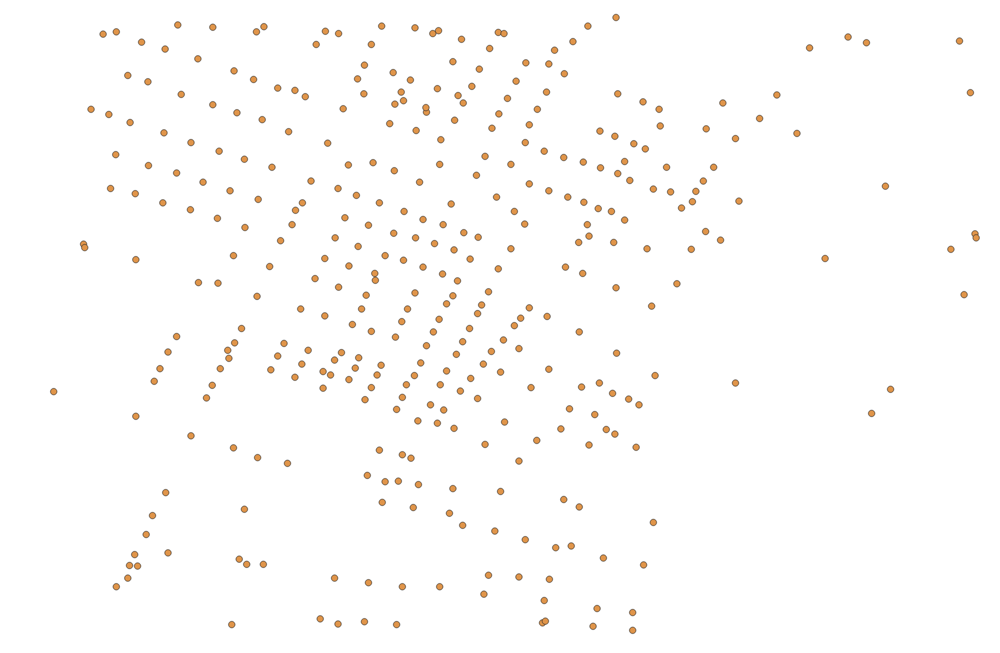
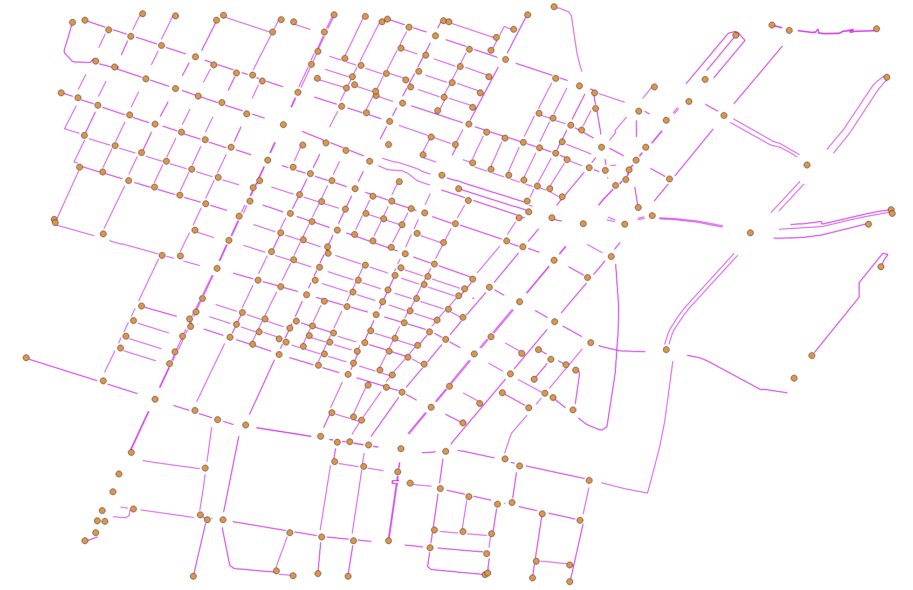
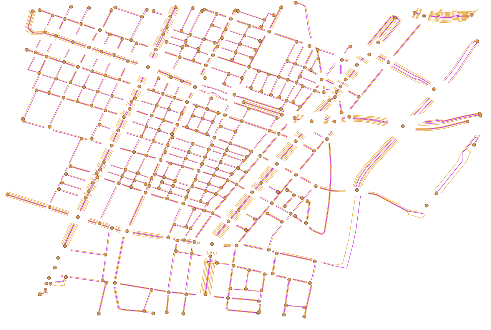

# 道路ネットワークのエクスポートの仕様

道路ネットワークのエクスポート機能で生成されるファイルの仕様をこのページに記します。  
下記のgeojsonファイルが生成されます。

## 交差点
**ファイル名: roadnetwork_node.geojson**  
  
上図は交差点の位置がエクスポートされたものです。  
道路ネットワーク内の交差点をノード情報として格納します。

#### 属性情報
- ID:交差点の識別子です。値は`Node(番号)`であり、(番号)は連番で割り振られた数値が入ります。

## 道路
**ファイル名: roadnetwork_link.geojson**  
  
上図の紫色の線に相当します。交差点（黄色い点）を接続します。  
道路を、ノード（交差点）間を接続するリンク情報として格納します。

#### 属性情報
- ID:道路の識別子です。値は`Link(一意の番号)_(上流ノードの番号)_(下流ノードの番号)`となります。
- UPNODE:上流ノードのIDです。例: `Node142`
- DOWNNODE: 下流ノードの識別子です。
- LENGTH:リンクの長さ（m）です。
- LANENUM: 車線数です。
- RLANENUM: 右折（付加）レーンの数です。
- RLANELENGTH: 右折（付加）レーンの長さ（m）です。
- LLANENUM: 左折（付加）レーンの数です。
- LLANELENGTH: 左折（付加）レーンの長さ（m）です。
- PROHIBIT: 街路網交通流シミュレーション AVENUEと互換性を持たせるために存在しますが、PLATEAU SDKでは常に同じ値が入ります。通行禁止情報であり、値はUターン禁止を意味する`u_turn`が常に入ります。
- TURNCONFIG: 街路網交通流シミュレーション AVENUEと互換性を持たせるために存在しますが、PLATEAU SDKでは常に同じ値が入ります。進行可能な方向の設定であり、値は直進、左折、右折可能を意味する7が常に入ります。
- TYPECONFIG: 街路網交通流シミュレーション AVENUEと互換性を持たせるために存在しますが、PLATEAU SDKでは常に同じ値が入ります。進行可能な車両の種類であり、値は小型車、大型車、バスの通行可能を意味する7が常に入ります。

## レーン
**ファイル名: roadnetwork_lane.geojson**  
  
上図のオレンジ色の線に相当します。  
各リンクに属する車線情報をレーン情報として格納します。

#### 属性情報
- ID:車線の識別子です。値は`Lane(対応するリンクの一意の番号)_(対応するリンクの上流ノードの番号)_(対応するリンクの下流ノードの番号)`となります。
- LINKID: 車線が属するリンクの識別子です。
- LANEPOS: 車線の位置を示す番号です。例えば道路に3つのレーンがある場合、番号は左から順に0, 1, 2となります。
- LENGTH:車線の長さ（m）です。
- WIDTH:車線の幅（m）です。

## トラック
**ファイル名: roadnetwork_track.geojson**
  
上図の交差点（黄色い点）の周りにある茶色の線に相当します。  
各交差点の通行可能な経路をトラック情報として格納します。

#### 属性情報
- ID:トラックの識別子です。値は`Track(対応するノードの番号)_(対応する上流リンクの番号)_(対応する下流リンクの番号)_(後述のORDERの番号)`となります。
- ORDER: 同じ交差点、同じ道路を接続するトラックが複数あるとき、それらを区別するための連番です。
- UPLINKID: 上流道路の識別子です。
- UPLANEPOS: 接続する上流道路のレーンのLANEPOSです。
- UPDISTANCE: 上流道路からの距離（m）です。
- DOWNLINKID: 下流道路の識別子です。
- DOWNLANEPOS: 接続する下流道路のレーンのLANEPOSです。
- DOWNDISTANCE: 下流道路からの距離（m）です。
- LENGTH: 軌跡の長さ（m）です。
- TURNCONFIG: 街路網交通流シミュレーション AVENUEと互換性を持たせるために存在しますが、PLATEAU SDKでは常に同じ値が入ります。進行可能な方向の設定であり、値は直進、左折、右折可能を意味する7が常に入ります。
- TYPECONFIG: 街路網交通流シミュレーション AVENUEと互換性を持たせるために存在しますが、PLATEAU SDKでは常に同じ値が入ります。進行可能な車両の種類であり、値は小型車、大型車、バスの通行可能を意味する7が常に入ります。

## 信号制御器
**ファイル名: roadnetwork_signalcontroler.geojson**  

[PLATEAU SDK-Toolkits for Unity](https://github.com/Project-PLATEAU/PLATEAU-SDK-Toolkits-for-Unity) の交通シミュレーション機能が有効な場合に生成されます。利用方法は[こちら](https://github.com/Project-PLATEAU/PLATEAU-SDK-Toolkits-for-Unity/tree/main/PlateauToolkit.Sandbox#10-%E4%BA%A4%E9%80%9A%E3%82%B7%E3%83%9F%E3%83%A5%E3%83%AC%E3%83%BC%E3%82%B7%E3%83%A7%E3%83%B3%E6%A9%9F%E8%83%BD)を参照してください。

  
上図は交通シミュレーション機能により車両用交通信号機が設置された交差点の位置がエクスポートされたものです。 
所属する信号灯火器を制御する情報を格納します。

#### 属性情報
- ID: 信号制御器の識別子です。値は `SignalController(対応するノードの番号)` となります。
- ALLOCNODE: 割り当てられたノードの識別子です。
- SIGLIGHT: 制御対象の信号灯火器識別子です。複数ある場合は「:」で連結します。
- OFFSETBASESIGID: オフセット基準となる信号制御器の識別子です。PLATEAU SDKでは常に空です。
- NUMOFPATTERN: 時間帯別の信号制御パターン数です。PLATEAU SDKでは常に `1` 固定です。
- PATTERNID: 使用する制御パターンの識別子です。複数ある場合は「:」で連結します。
- INITCYCLE: 制御サイクルの長さ（秒）です。
- PHASENUM: 信号現示数です。
- OFFSETTYPE: オフセットタイプです。相対オフセットの場合は `1`、絶対オフセットの場合は `0` となります。PLATEAU SDKでは常に `0` 固定です。
- OFFSET: オフセット値（秒）です。PLATEAU SDKでは常に `0` 固定です。
- STARTTIME: 制御パターンの開始時刻です。`hh:mm:ss` 形式で `:` で連結します。

## 信号灯火器
**ファイル名: roadnetwork_signallight.geojson**  

[PLATEAU SDK-Toolkits for Unity](https://github.com/Project-PLATEAU/PLATEAU-SDK-Toolkits-for-Unity) の交通シミュレーション機能が有効な場合に生成されます。利用方法は[こちら](https://github.com/Project-PLATEAU/PLATEAU-SDK-Toolkits-for-Unity/tree/main/PlateauToolkit.Sandbox#10-%E4%BA%A4%E9%80%9A%E3%82%B7%E3%83%9F%E3%83%A5%E3%83%AC%E3%83%BC%E3%82%B7%E3%83%A7%E3%83%B3%E6%A9%9F%E8%83%BD)を参照してください。

  
上図は交通シミュレーション機能により設置された車両用交通信号機の位置がエクスポートされたものです。 
車両用交通信号機についての情報を格納します。

#### 属性情報
- ID: 信号灯火器の識別子です。値は `SignalLight(属する信号制御器の番号)_(灯火グループ)_(灯火グループ内の順番)` となります。
- SIGNALID: 属する信号制御器の識別子です。
- LINKID: 設置対象のレーンの識別子です。
- LANETYPE: 規制対象レーン種別です。PLATEAU SDKでは常に `lane` 固定です。
- LANEPOS: 規制対象レーン番号です。PLATEAU SDKでは常に全レーンを示す `-1` 固定です。
- DISTANCE: 信号灯火器の設置位置で停止線からの距離（m）です。

## 信号現示階梯
**ファイル名: roadnetwork_signalstep.geojson**  

[PLATEAU SDK-Toolkits for Unity](https://github.com/Project-PLATEAU/PLATEAU-SDK-Toolkits-for-Unity) の交通シミュレーション機能が有効な場合に生成されます。利用方法は[こちら](https://github.com/Project-PLATEAU/PLATEAU-SDK-Toolkits-for-Unity/tree/main/PlateauToolkit.Sandbox#10-%E4%BA%A4%E9%80%9A%E3%82%B7%E3%83%9F%E3%83%A5%E3%83%AC%E3%83%BC%E3%82%B7%E3%83%A7%E3%83%B3%E6%A9%9F%E8%83%BD)を参照してください。

  
上図は信号現示階梯がエクスポートされたものです。位置は対象となる信号制御器と同じになります。
信号制御器が制御する信号の切り替え順序やパターン（現示階梯）に関する情報が格納されます。

#### 属性情報
- ID: 信号現示階梯の識別子です。値は `SignalStep(対象の信号制御器の番号)_(階梯順番)` となります。
- SIGNALID: 信号制御器の識別子です。
- PATTERNID: 制御パターン番号です。
- ORDER: 階梯順番です。
- DURATION: 階梯の持続時間（秒）です。
- SIGLIGHT: 制御信号灯火器の識別子です。
- TYPEMASK: 進入許可車種規制マスクです。PLATEAU SDKでは常に同じ値が入り、小型車・大型車・バスの通行を許可する `7` が設定されます。
- GREEN: 青現示方向リンクペアです。ペアは `->` で表し、複数ある場合は `:` で連結します。
- YELLOW: 黄現示方向リンクペアです。ペアは `->` で表し、複数ある場合は `:` で連結します。
- RED: 赤現示方向リンクペアです。ペアは `->` で表し、複数ある場合は `:` で連結します。