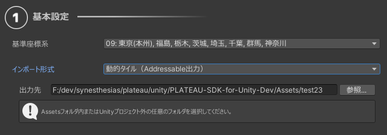

# 【試験的機能】動的タイル機能について

## 概要
広大な範囲を表示したいとき、描画負荷を抑えつつ表示できる機能です。  
例えば、下図のように範囲選択画面で新宿区のすべての建物をインポートしたいとします。  

  

通常のシーンへのインポートであれば、描画負荷が問題となり実用の難しさが課題でした。  
そこで動的タイル機能を使えば、下図のとおりすべて表示できます。  
ただしPCのスペックによります。  

> [!NOTE]
> 現在の動的タイルでは、タイル以外の一部PLATEAU SDK機能を適用できません。  
> 例）モデル調整、道路ネットワーク生成  
> 将来的に対応予定です。

## 描画負荷が軽減される仕組み
本機能は次の処理からなります。
- 3D都市モデルをタイル状に分けます。
- Addressableの機能を使って3D都市モデルを出力します。  
- 出力時、各タイルが最適化されます（後述）。
- 読込時、カメラの距離に応じてタイルを読み込みます。

### 都市のタイルの最適化手法
本機能は試験的機能であり、今後も新たな最適化を追加していく予定です。
- 【実装済】テクスチャサイズの変更
  - 各タイルで利用されるテクスチャの大きさについて、縦と横でそれぞれ等倍のタイル、2分の1のタイル、そして4分の1にしたタイルを出力します。
  - カメラに近いタイルは解像度の高いテクスチャ版を読み込み、遠いタイルは解像度の低いテクスチャ版を読み込みます。
  - PLATEAUデータはテクスチャが大きい傾向にあるため、これにより描画負荷が減ります。
- 【実装済】遠いタイルを消す
  - カメラからかなり遠いタイルは読み込まず、シーンから消去します。
- 【今後実装予定】タイルのサイズを変更する
  - 各タイルの大きさについて、3次メッシュコードを基準とし、それを2×2に結合したサイズと2×2に分割したサイズを作ります。
  - カメラから遠いタイルは結合した版を読み込むことで、オブジェクト数とディスク読込回数を減らします。
- 【実装済】ポリゴン数の低いLOD1の建物に、LOD2のテクスチャを投影することでポリゴン数を下げます。

## 動的タイル形式でのインポート方法

  

- インポートの設定画面で、インポート形式を`動的タイル（Addressable出力）`にします。
- 出力先を指定します。プロジェクト外でも動作しますが、ビルドに含めたい場合はAssetsフォルダ内のお好みのフォルダを選びます。
  - 前と同じ出力先を指定した場合、タイルの上書きではなく追加となります。
- 範囲選択など、他のインポート設定をしてインポートボタンを押します。
  - インポート設定については[こちら(3D都市モデルのインポート)](./ImportCityModels.md)とおおむね同じです。
  - ただし、モデル結合の粒度については地域単位に固定されます。
- インポートおよびAddressableのビルドが行われ、完了すると3D都市モデルがタイル形式で読み込まれ表示されます。

## 動的タイルの動作

- シーンビューでは、タイルと視点の距離に応じたタイルが読み込まれます。
- プレイ中は、タイルとメインカメラの距離に応じたタイルが読み込まれます。
- タイルの管理は、シーンに配置された`DynamicTileManager`が行います。

### 生成されるアセット
- 出力先フォルダをAssetsフォルダ内に設定した場合
  - 出力先にタイルのプレハブが生成されます。
  - `Assets/StreamingAssets/PLATEAUBundles/(出力先フォルダ名)`にアセットバンドルがビルドされます。
- 出力先フォルダをプロジェクト外に設定した場合
  - 出力先にアセットバンドルがビルドされます。
  - `Assets/PLATEAUBundles/(出力フォルダ名)`にプレハブが生成されます。
    - プロジェクト外への出力のケースでプレハブ非依存にする機能は今後実装予定です。

## DynamicTileManagerの操作
  

シーンに配置された`DynamicTileManager`を選択すると、インスペクターから次の操作ができます。
- `Addressableカタログパス(json)`の指定
  - 参照ボタンからAddressableのカタログ(json)を指定することで、読み込む動的タイルのセットを変更できます。
  - カタログファイルとはAddressableの仕様上、アセットバンドルのビルド時に生成されるものです。  
    カタログの場所は上記「生成されるアセット」に記載のアセットバンドルのビルド先に生成されます。
- `シーンビューで都市にフォーカス`ボタンを押すと、シーンビューの視点が都市を映す位置に移動します。
- `SDKデバッグ用情報を表示`のチェックを入れると、インスペクタにデバッグ用の詳細情報が表示されます。詳しくは後述します。

## LOD2テクスチャ投影による建物モデルの軽量化

動的タイル機能では、建物データの軽量化のために、LOD1の建物形状に対し、LOD2 の外観を画像として貼り付ける方式を採用しています。

具体的には以下の処理を行っています。
- LOD2の建物3Dモデルを方向からキャプチャ
  - 建物の外観を平面的な画像（テクスチャ）として生成します。
- LOD1 の低ポリゴンモデルに対してTriplanarシェーダーで投影
  - 該当する方向のLOD2画像が滑らかに貼り付けられ、窓・外壁模様などLOD2の質感をポリゴン数を下げたまま視覚的に再現できます。

この最適化により建物モデルのポリゴン数を大幅に削減しつつ、LOD2 に近い外観を維持できます。これにより、広域の都市表示でも描画負荷を抑え、軽快に動作させることが可能になります。

## デバッグ情報
DynamicTileManagerのインスペクタから「SDKデバッグ用情報」にチェックを入れると次のボタンと情報がインスペクタに表示されます。
- `Clear Tile Assets`: 読み込んだタイルをシーンから消去します。
- `Clear Tile List`: 保持しているタイル情報を消去します。元に戻すには「参照」からカタログを指定します。
- `Load Tile Scriptable Objects`: タイルの情報を読み直します。
- `Show Tile Bounds`: 各タイルのBounds(範囲)を線で表示します。
- `Show Zoom Level`: タイルのズームレベル（詳細度）を数字で表示します。
  - ズームレベル11番: もっとも詳細で、テクスチャ解像度は等倍です。
  - ズームレベル10番: 2番目に詳細で、テクスチャ解像度は縦と横が2分の1倍です。
  - ズームレベル9番:  もっとも粗く、テクスチャ解像度は縦と横が4分の1倍です。
- `Cancel Load Task`: ロードに異様に時間がかかっているタイルがある場合、進行中の読み込みを取り消します。
- `Disable Realtime Load On Editor`: エディタでの視点位置に応じたタイルの読み込みを停止します。
- `Update Assets On Camera Position`: カメラ位置に応じたタイルの読み込みをやり直します。
- `Zoom Level & Load Distance`: 各ズームレベルがカメラからのどの距離で読み込まれるかを設定します。Load DistanceのXが最小距離、Yが最大距離です。
- `各タイルの情報`: 各タイルのAddressableのアドレス、位置、ズームレベル、ゲームオブジェクト、カメラからの距離、読み込み状態が表示されます。
- `Use Job System`: タイルとカメラの距離判定にJob Systemを利用します。
- `Show Debug Log`: チェックを入れると詳細なログを表示します。
  
本機能は試験的機能のため、変更になる場合があります。