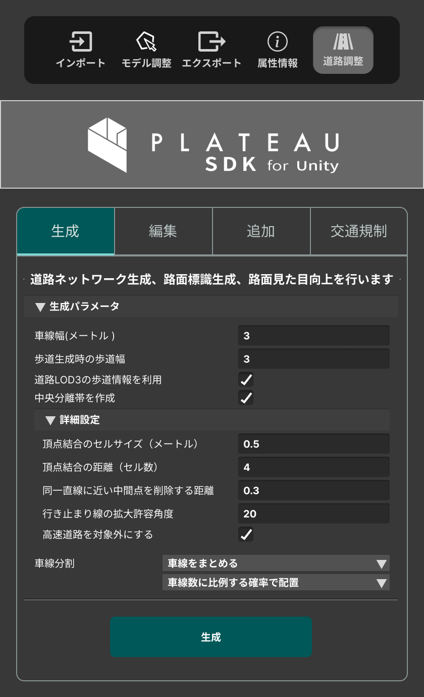
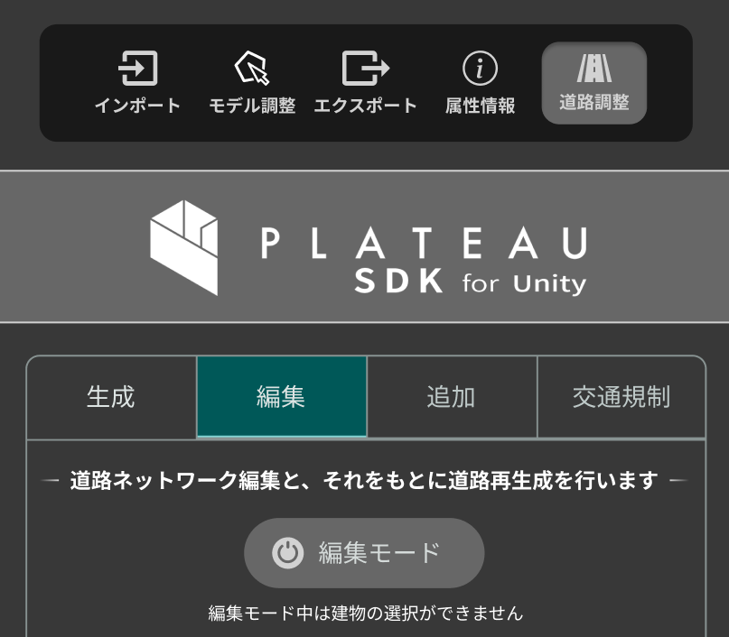
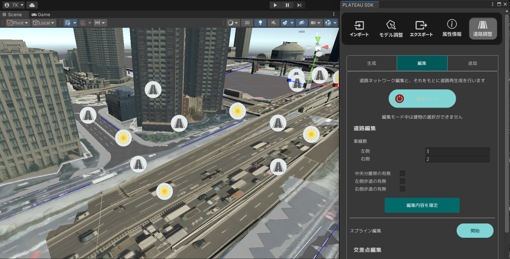
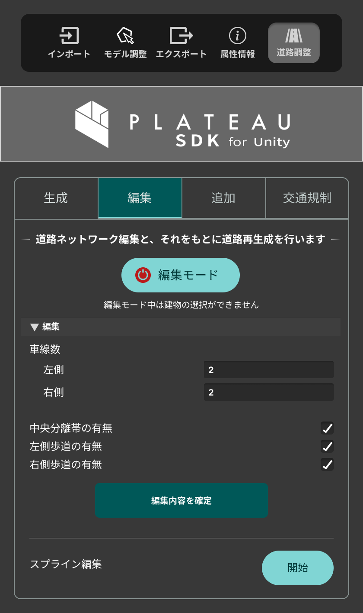
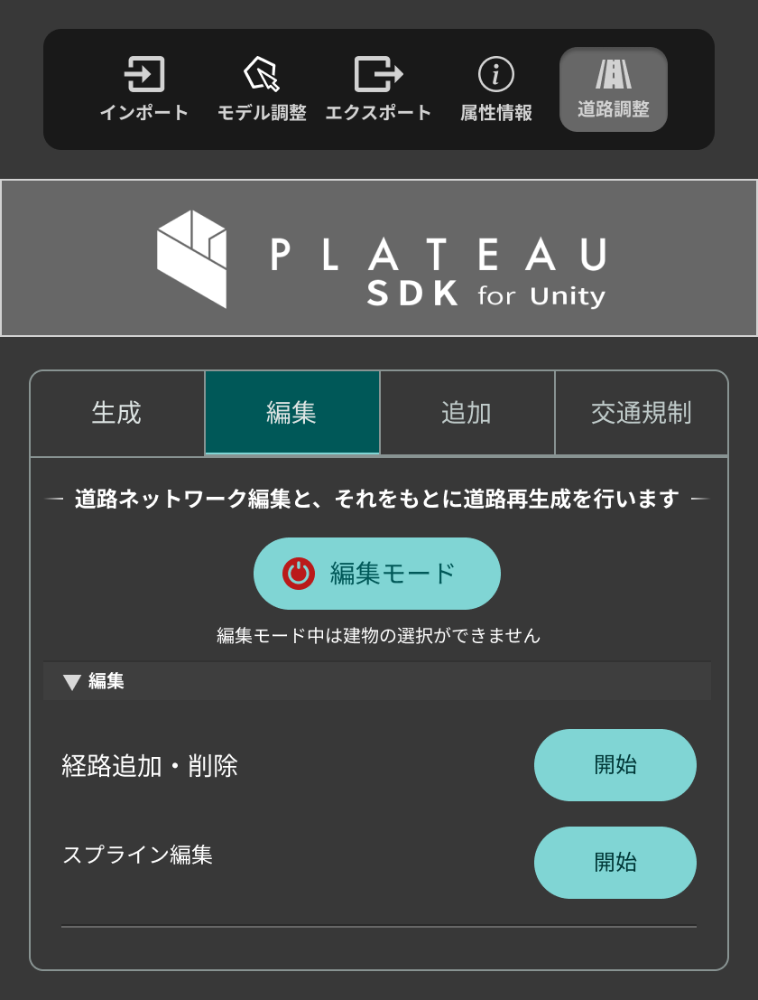

# 道路調整

このページでは道路調整機能について説明します。

## 準備

- 事前に３次メッシュ情報が含まれた地形をシーンに配置します。

## 生成

シーンに配置されている地形に対して道路ネットワーク生成、路面標識生成、路面見た目向上を行います。

生成パラメータ
道路生成時の各種設定を行います。

- `車線幅（メートル）` : 車線の幅
- `歩道生成時の歩道幅` : 歩道の幅
- `道路LOD3の歩道情報を利用` : 歩道情報を利用します
- `中央分離帯を作成` : 生成時に中央分離帯を作成します

詳細設定

- `頂点結合のセルサイズ（メートル）` :
- `頂点結合の距離（セル数）` :
- `同一直線に近い中間点を削除する距離` :
- `行き止まり線の拡大許容角度` :
- `高速道路を対象外にする` :

車線分割

- `車線をまとめる \ 車線ごとに分ける` : 車線の分割・結合設定
- `車線数に比例する確率で配置 \ 全ての交差点に配置` : 車線配置に関する設定

上記設定を行い「生成ボタン」を押下すると自動で道路ネットワークが生成されます。

## 編集

生成した道路ネットワークの編集を行います。

### 編集方法

- 道路ネットワークを編集するには編集メニュー内「編集モード」ボタンを押下します。
- 編集モード中は建物が選択できなくなります。（建物等選択したい場合は再度「編集モード」ボタンを押して OFF にします）

#### 編集モード画面

- シーンビュー上に「道路」アイコン・「交差点」アイコンが表示されます。
- 各アイコンを選択すると Editor 上で各種編集が行えます。

#### 道路編集

- `車線数` : 車線の数を設定します。
- `中央分離帯の有無` : 中央分離帯の有無を設定します。
- `右側歩道の有無` : 右側歩道の有無を設定します。
- `左側歩道の有無` : 左側歩道の有無を設定します。

- `スプライン編集` : 開始ボタンを押すと道路の形状を編集します。再度終了ボタンを押下でスプライン編集状態を解除できます。

#### 交差点編集

- `経路追加・削除` : 「開始ボタン」を押すと流入点と流出点を繋いで新規経路の作成が行えます。既存の経路の削除も同時に行えます。再度「終了ボタン」を押下でスプライン編集状態を解除できます。 
- `スプライン編集` : 「開始ボタン」を押すと交差点の形状を編集します。再度「終了ボタン」を押下でスプライン編集状態を解除できます。 