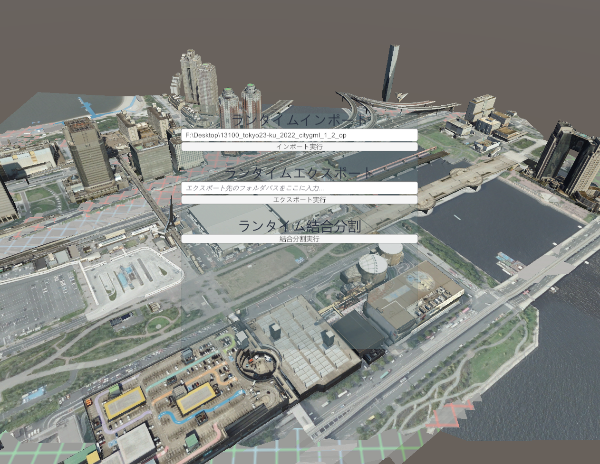

# ランタイムAPI

このページでは、PLATEAU SDKの機能をUnityエディタ内だけでなくランタイム（実行時）にも利用するための方法を説明します。

## APIサンプルの実行方法

ランタイムAPIのサンプルシーンを次の方法で開いて実行できます。  
- Package ManagerからPLATEAU SDKのサンプルをインポートします。
- `Assets/Samples/PLATEAU SDK for Unity/(バージョン)/PLATEAU Samples/APISample/RuntimeSample` のシーンを開きます



- 事前に東京都23区のPLATEAUデータをダウンロードしておきます。
- サンプルシーンを再生し、「インポート実行」ボタンの上にある入力欄にダウンロードしたフォルダのパスを入力してインポート実行します。
- しばらく待つと、シーン中に都市モデルが表示されます。
- 都市モデルがインポートされた状態で、エクスポートと分割結合を試すことができます。
- エクスポートするには、入力欄にエクスポート先のフォルダパスを入力してからエクスポート実行します。
- 分割結合すると、見た目は変わりませんが、ゲームオブジェクトの粒度が主要地物単位から地域単位に変わっていることをインスペクタから確認できます。

## サンプルコードの解説
サンプルコードは次の場所にあります。  
`Assets/Samples/PLATEAU SDK for Unity/(バージョン)/PLATEAU Samples/APISample/RuntimeAPISample.cs`
  
以下にそのコードを解説します。  
  
### インポート
```csharp
/// <summary>
/// ランタイムでインポートするコードです。
/// </summary>
public async void Import()
{
    // インポートのパスをUnityのテキストフィールドから取得します。
    string importPath = importPathInputField.text;
    // PLATEAUのデータセットの場所をセットします。
    var datasetConf = new DatasetSourceConfigLocal(importPath);
    // インポート対象のメッシュコード（範囲）を指定します。文字列形式の番号の配列からMeshCodeListを生成できます。
    var meshCodesStr = new string[] { "53393652" };
    var meshCodeList = MeshCodeList.CreateFromMeshCodesStr(meshCodesStr);
    // データセットやメッシュコードから、インポート設定を生成します。
    var conf = CityImportConfig.CreateWithAreaSelectResult(
        new AreaSelectResult(new ConfigBeforeAreaSelect(datasetConf, 9), meshCodeList));
    // ここでconfを編集することも可能ですが、このサンプルではデフォルトでインポートします。
    await CityImporter.ImportAsync(conf, null, null);
}
```
インポート処理は`await CityImporter.ImportAsync(conf, null, null);`で実行できます。  
ここでconfはインポート設定となります。  
インポート設定`conf`のうち、最低限指定が必要となる項目は次の通りです。
- データ一式がどこにあるのか(`DatasetSourceConfigLocal`)
- 座標系の番号は何か(上のサンプルでは`9`としています)
- インポート対象のメッシュコード（範囲、`MeshCodeList`）はどこか
  
したがって、上のサンプルでは`DatasetSourceConfigLocal`, `MeshCodeList`のインスタンスを設定しています。  
他にも`conf`には、地物別の設定など、エディタのGUIで設定可能な項目が含まれています。  
このサンプルではそれらの値はデフォルトのままとしています。

### エクスポート
```csharp
/// <summary>
/// ラインタイムでエクスポートするコードです。
/// </summary>
public void Export()
{
    // 前提条件：
    // 実行するには、ターゲットのstatic batchingをオフにする必要があります。
    // そのためにはstaticのチェックをインスペクタから外します。
    
    // エクスポート先をUnityのテキストフィールドから取得します。
    string exportDir = exportPathInputField.text;
    // エクスポート設定です。
    var option = new MeshExportOptions(MeshExportOptions.MeshTransformType.Local, true, false,
        MeshFileFormat.FBX, CoordinateSystem.ENU, new CityExporterFbx());
    // 都市モデルを取得します。
    var target = FindObjectOfType<PLATEAUInstancedCityModel>();
    if (target == null)
    {
        Debug.LogError("都市モデルが見つかりませんでした。");
        return;
    }
    // エクスポートします。
    UnityModelExporter.Export(exportDir, target, option);
}
```
エクスポート処理は `UnityModelExporter.Export(exportDir, target, option)` でできます。  
ここで`exportDir`はエクスポート先のパス、`target`はエクスポートする都市モデル、`option`がエクスポートに関する設定値です。  
`option`こと`MeshExportOptions`には座標変換、ファイル形式、座標軸の向きが含まれます。  
`new MeshExportOptions()`の最後の引数には、ファイル形式に対応したExporterのインスタンスを渡します。  
`new CityExporterXXX` (XXXはファイル形式) と書けば大丈夫です。

### 分割結合
```csharp
/// <summary>
/// ランタイムで結合分割（ゲームオブジェクトの粒度の変更）をするコードです。
/// </summary>
public async void GranularityConvert()
{
    // 都市オブジェクトを取得します。
    var target = FindObjectOfType<PLATEAUInstancedCityModel>();
    if (target == null)
    {
        Debug.LogError("都市モデルが見つかりませんでした。");
        return;
    }

    // 分割結合の設定です。
    var conf = new GranularityConvertOptionUnity(new GranularityConvertOption(MeshGranularity.PerCityModelArea, 1),
        new[] { target.gameObject }, true);
    // 分割結合します。
    await new CityGranularityConverter().ConvertAsync(conf);
}
```
オブジェクトを分割結合し、粒度を変更します。  
`await new CityGranularityConverter().ConvertAsync(conf)` で実行できます。  
ここで`conf`は分割結合の設定であり、次のように設定できます。  
`new GranularityConvertOptionUnity(new GranularityConvertOption(ここに粒度を入れる, 1),
ここに変換対象の配列を入れる, 元のオブジェクトを消すならtrueで残すならfalse);`  
なお`new GranularityConvertOption`の2つ目の引数である`1`は、未実装の設定項目のためどの数値をいれても動作に影響しません。