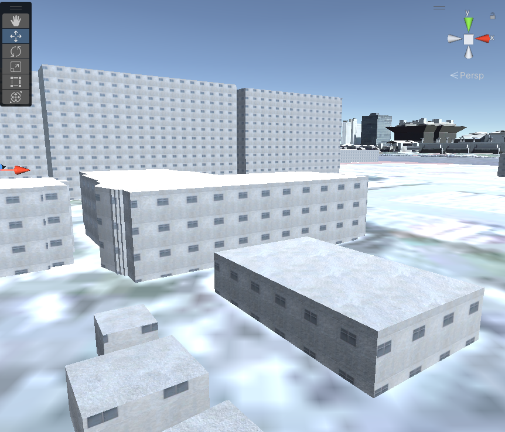

# PLATEAU SDKのマテリアルについて

## デフォルトマテリアルの見た目を変えたいとき
PLATEAU SDKでは地物タイプごとにデフォルトマテリアルが用意されています。  
例えば、下図の建物には建築物のデフォルトマテリアルが適用されています。

このマテリアルは独自のPlateauTriplanarシェーダーを利用しているため、UVのない地物にもテクスチャを投影できます。  
PLATEAUのモデルにはUVが**ない**場合があります。  
そのため、ご自分で見た目をカスタマイズする場合でも、SDK付属のPlateauTriplanarシェーダー、またはそれと同様のTriplanar機能を有したシェーダーを利用することを推奨します。  
以下に同シェーダーを使ったマテリアルの作成方法を説明します。
### SDK付属のシェーダーについて
PLATEAU SDKには以下の3つのシェーダーが付属しています。  
どれもUVなしでテクスチャを投影できるのが特徴です。
- `PlateauTriplanarShader(Opaque)`
    - 通常のTriplanarシェーダーです。
- `PlateauTriplanarShader(Transparent)`
    - 半透明なTriplanarシェーダーです。
- `PlateauTriplanarShader(DualTextures)`
    - 上下を向いた面と横を向いた面で異なる見た目を表現するTriplanarシェーダーです。
    - 利用例：建築物の上を向いた面をコンクリートの屋根に、側面を窓付きの壁にしたい場合などに利用できます。

### マテリアルの作り方
このシェーダーを使ってマテリアルを作成する手順は次のとおりです：
- 新しいマテリアルを新規作成し、そのシェーダーを PlateauTriplanarShader/PlateauTriplanarShader(Opaque, Transparent, DualTexturesのいずれか)にします。
- マテリアルにテクスチャを割り当て、設定します。設定項目は次のとおりです：
    - `MainTexture` : メインのテクスチャです。
    - `NormalMap` : ノーマルマップです。
    - `NormalMapStrength` : ノーマルマップの強さです。
    - `Tiling` : テクスチャをタイリングさせる大きさです。
    - `Blend` : ポリゴンの向きに応じてテクスチャをブレンドさせる程度です。
    - `Metallic` : メタリック（金属感の強さ）です。
    - `MetallicTexture` : メタリックを表現するテクスチャです。
    - `Roughness` : ラフネス（ざらざら感の強さ）です。
    - `RoughnessTexture` : ラフネスを表現する強さです。
    - `AmbientOcclusion` : アンビエントオクルージョン(環境光の影響を受ける程度)です。
    - `AmbientOcclusionTex` : アンビエントオクルージョンを表現するテクスチャです。
    - `EmissionColor` : エミッション（発光）の色です。
    - `EmissionTexture` : エミッションを表現するテクスチャです。
    - `Opacity`(Transparentシェーダーのみ) : 不透明度です。

  DualTextureシェーダーでは、上記の設定値がそれぞれ`Top`と`Side`の2つに分かれます。Topは上下面、Sideは側面の見た目を設定します。

- 自作したマテリアルは、インポート後にドラッグ＆ドロップ等で適用できるほか、インポートの設定項目として「デフォルトマテリアル」に指定できます。