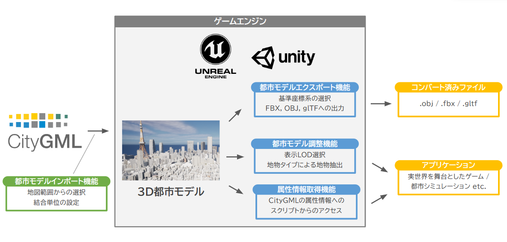
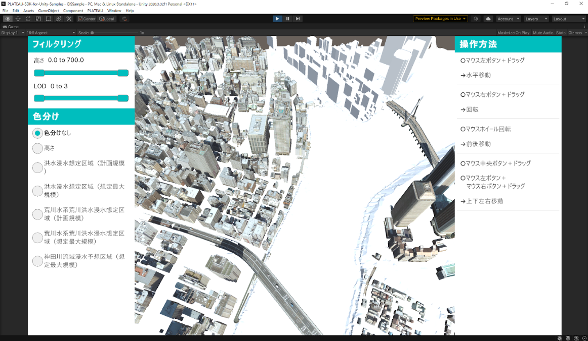
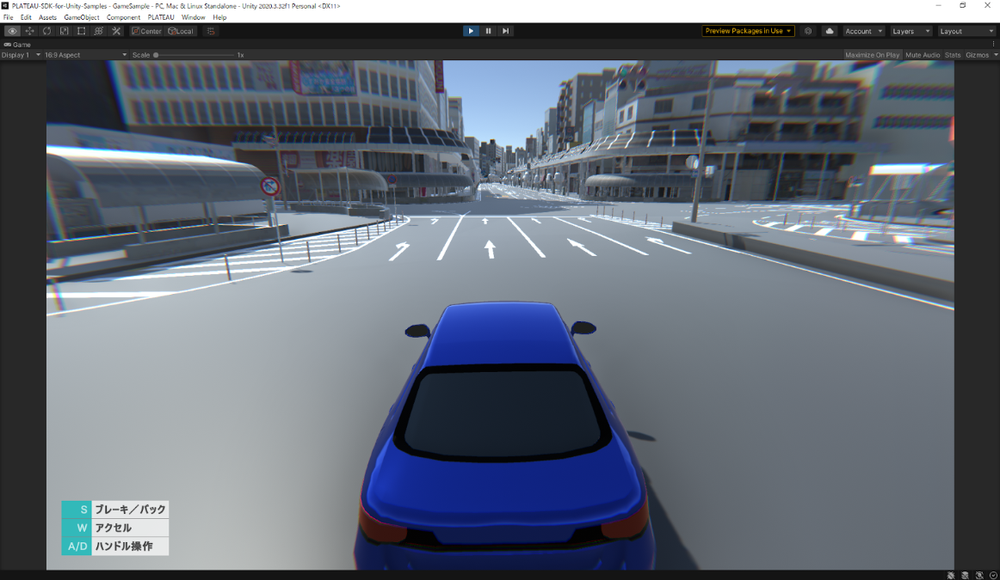

# PLATEAU SDK for Unity
PLATEAU SDK for Unityは、[PLATEAU](https://www.mlit.go.jp/plateau/)の3D都市モデルデータをUnityで扱うためのツールキットであり、主に以下の機能を提供しています。

- CityGMLの直感的なインポート
  - 地図上での範囲選択による3D都市モデルの抽出
  - PLATEAUのサーバーで提供されるCityGMLデータへのアクセス
- 3D都市モデルに含まれる地物のフィルタリング
- 3D都市モデルの3Dファイル形式へのエクスポート
- 3D都市モデルの属性にアクセスするためのC# API

PLATEAU SDK for Unityを利用することで、実世界を舞台にしたアプリケーションの開発や、PLATEAUの豊富なデータを活用したシミュレーションを簡単に行うことができます。

# サンプルプロジェクト
本SDKを使用して作成されたサンプルプロジェクトを[こちら](https://github.com/Project-PLATEAU/PLATEAU-SDK-for-Unity-Samples)で配布しています。

&nbsp;
</a>&nbsp;

# 動作環境
- Windows（x86_64）
- MacOS（ARM）
- Android、iOS
  - モバイル向けには、一部の機能のみ（緯度経度と直交座標の相互変換など）をサポートしています。

# 利用手順
- SDKの最新版は[Releaseページ](https://github.com/Project-PLATEAU/PLATEAU-SDK-for-Unity/releases)からダウンロードしてください。
- 詳しい利用方法については、こちらの[マニュアル](https://Project-PLATEAU.github.io/PLATEAU-SDK-for-Unity/index.html) をご覧ください。
- PLATEAU公式ウェブサイトでは当SDKの [チュートリアル記事](https://www.mlit.go.jp/plateau/learning/tpc17-1/) も公開しています。

# 注意点
- 現在、この SDKとドキュメントは日本語のみ対応しています。
- 都市モデルのインポート方法は「ローカル」と「サーバー」の2種類ありますが、  
  ローカルを推奨します。サーバーモードで利用できるデータはまだ少ないためです。  
  SDK向けのサーバーデータは2023年度中に対象範囲を拡充予定です。

## ライセンス
- 本リポジトリはMITライセンスで提供されています。
- ソースコードおよび関連ドキュメントの著作権は国土交通省に帰属します。

## 注意事項
- 本リポジトリの内容は予告なく変更・削除する可能性があります。
- 本リポジトリの利用により生じた損失及び損害等について、国土交通省はいかなる責任も負わないものとします。
